# Storyboard Specification: AbaQuest-1 The Naming (updatd images).pptx

## Scene 1
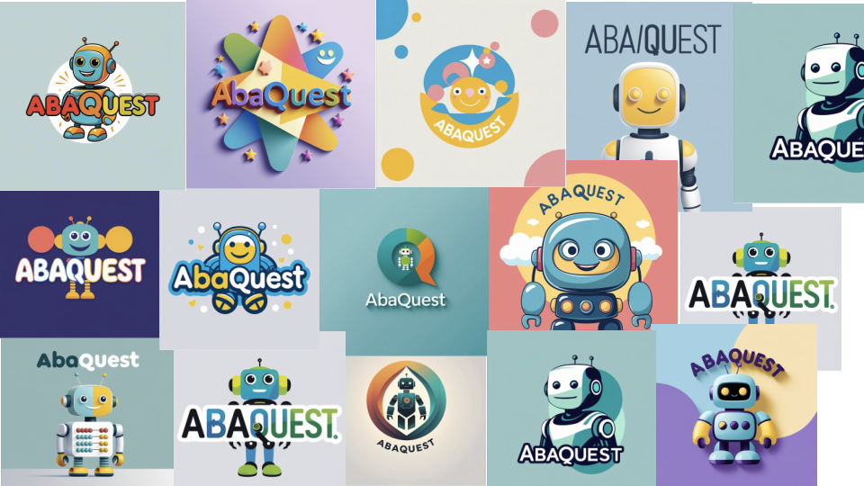

### Content

### Narrator Script (Cousin's Voice)
> 0. Launch / Login
User: StudentInputs: Student taps their name / picture (no typing)System does:
Confirms consent flag (site-level)
Loads student profile (grade band K / 1 / 2, last save point, current skill focus)
Sends “student active” ping to teacher dashboard
Teacher dashboard data: timestamp, which student logged in, which Quest launched

---

## Scene 2
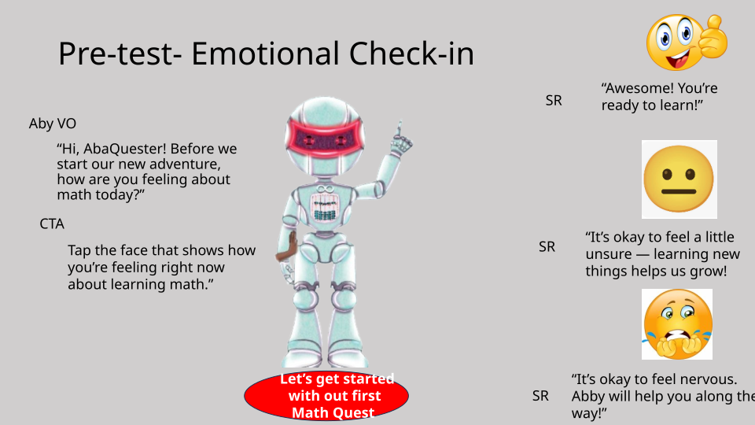

### Content
- Pre-test- Emotional Check-in
- “Hi, AbaQuester! Before we start our new adventure, how are you feeling about math today?”
- Tap the face that shows how you’re feeling right now about learning math.”
- CTA
- Aby VO
- “Awesome! You’re ready to learn!”
- “It’s okay to feel nervous. Abby will help you along the way!”	
- SR
- SR
- Let’s get started with out first Math Quest
- “It’s okay to feel a little unsure — learning new things helps us grow!
- SR

### Narrator Script (Cousin's Voice)
> Dev. Notes:
When user selects an emoji, play soft chime → show “Let’s Go!” button.
Transition to next slide with swirl or sparkle animation.

---

## Scene 3
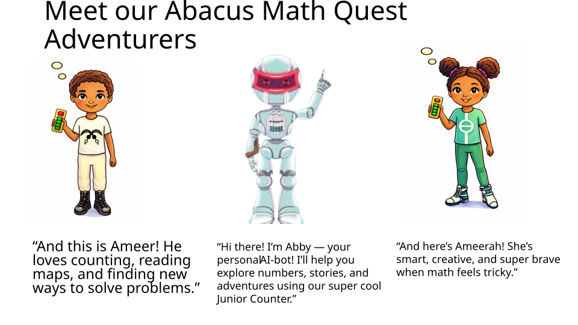

### Content
- Meet our Abacus Math Quest Adventurers
- “And this is Ameer! He loves counting, reading maps, and finding new ways to solve problems.”
- “Hi there! I’m Abby — your personal  AI-bot! I’ll help you explore numbers, stories, and adventures using our super cool Junior Counter.”
- “And here’s Ameerah! She’s smart, creative, and super brave when math feels tricky.”

---

## Scene 4
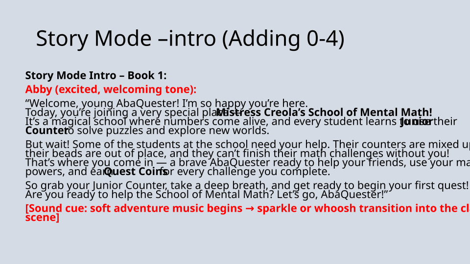

### Content
- Story Mode –intro (Adding 0-4)
- Story Mode Intro – Book 1: 
Abby (excited, welcoming tone):
“Welcome, young AbaQuester! I’m so happy you’re here.Today, you’re joining a very special place — Mistress Creola’s School of Mental Math!It’s a magical school where numbers come alive, and every student learns to use their Junior Counter to solve puzzles and explore new worlds.
But wait! Some of the students at the school need your help. Their counters are mixed up, their beads are out of place, and they can’t finish their math challenges without you!That’s where you come in — a brave AbaQuester ready to help your friends, use your math powers, and earn Quest Coins for every challenge you complete.
So grab your Junior Counter, take a deep breath, and get ready to begin your first quest!Are you ready to help the School of Mental Math? Let’s go, AbaQuester!”
[Sound cue: soft adventure music begins → sparkle or whoosh transition into the classroom scene]

---

## Scene 5

### Content
- Story mode (Narrative- naming junior counter)
- “It was the twins’ first day at the School of Mental Math.Ameerah was curious about who her new friends would be.Ameer hoped the math wouldn’t be too hard, he was nervous.They were both quiet as they walked to their boat.Ameer’s heart beat fast.Ameerah smiled and said, “I’ll steer today!”She was nervous too—but ready to be brave.”

---

## Scene 6
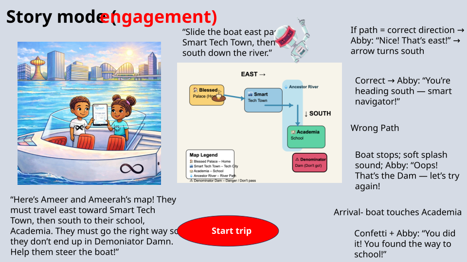

### Content
- Story mode (engagement)
- “Here’s Ameer and Ameerah’s map! They must travel east toward Smart Tech Town, then south to their school, Academia. They must go the right way so they don’t end up in Demoniator Damn. Help them steer the boat!”
- Start trip
- If path = correct direction → Abby: “Nice! That’s east!” → arrow turns south
- Correct → Abby: “You’re heading south — smart navigator!”
- Wrong Path
- Boat stops; soft splash sound; Abby: “Oops! That’s the Dam — let’s try again!
- Arrival- boat touches Academia
- Confetti + Abby: “You did it! You found the way to school!”
- “Slide the boat east past Smart Tech Town, then turn south down the river.”

### Narrator Script (Cousin's Voice)
> I need to design the map a little better, but this diagram gives the general gist. 

User Interactions
Step 1 – First Move
User taps East arrow
Boat animation: Move right across the river toward Smart Tech Town.
Sound: Gentle water splash or rowing effect.
Abby VO:
“Nice! That’s East — Smart thinking!”
Reward: +1 Quest Coin → animation shows coin dropping into top-right counter.
On-screen text:
“You earned 1 Quest Coin for guiding the twins correctly!”
Step 2 – Second Move
User taps South arrow
Boat animation: Move down toward the School of Mental Math.
Sound: Gentle water ripple or bell chime when they arrive.
Abby VO:
“You’re heading South — straight to school! Great navigation!”
Reward: +2 Quest Coins → add sparkle around the coin counter.
On-screen text:
“You earned 2 Quest Coins for completing your journey!”
Step 3 – Arrival
Boat reaches dock at School of Mental Math
Confetti animation.
Abby VO:
“You did it! You found the way to school — what a smart navigator!”
Add +1 bonus Quest Coin for completing the full map.
Total coins from map: +4 Quest Coins.
❌ Incorrect Path Behavior
If user taps West or North:
Boat moves slightly, then stops.
Sound: Soft splash + “oops” sound.
Abby VO:
“Oops — that’s the Dam! Let’s try again, AbaQuester.”
Visual: Boat gently shakes or ripples backward.
No coins earned for wrong tap.
🪙 Quest Coin Animation Details
Each time a coin is earned:
Coin drops into the top-right counter with a sparkle and soft chime (SFX_COIN_CHIME).
Show text overlay briefly at the bottom:
“+1 Quest Coin!”or“+2 Quest Coins!”
Fade out in 2 seconds.
At the end of the map sequence:
Total reward popup:
“Map Quest Complete! You earned 4 Quest Coins!”
Abby VO:
“You completed your first map quest and earned 4 Quest Coins! Amazing work, AbaQuester!”

---

## Scene 7
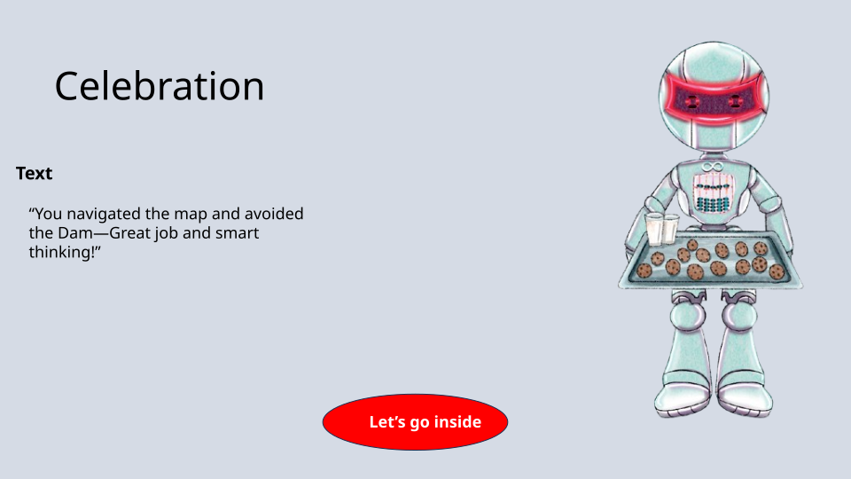

### Content
- Celebration
- “You navigated the map and avoided the Dam—Great job and smart thinking!”
- Text
- Let’s go inside

### Narrator Script (Cousin's Voice)
> After the learner finishes the quest, Abby does a short, funny celebration dance to make the win feel BIG and joyful.

Abby Dance Animation (kid-appropriate)
Animation name: abby_victory_wiggle
Description for animators:
Duration: 2–3 seconds
Abby does a side-to-side hip/torso wiggle (not a twerk), with arms up
Head tilts left → right in rhythm
Feet do a tiny bounce in place
Add 2 sparkles around her on beats 1 and 3
Loopable once (no endless loop unless user taps “Play again”)
Movement beats (simple):
Beat 1 – Abby raises both arms, leans right
Beat 2 – Lean left, small hip/torso wiggle
Beat 3 – Spin or half-turn + sparkle
Beat 4 – Land in “ta-da!” pose

---

## Scene 8
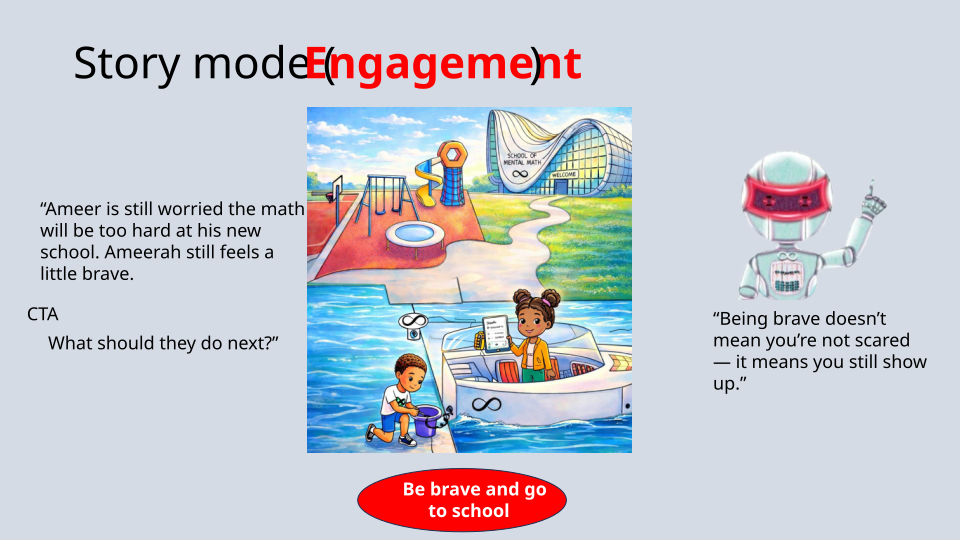

### Content
- Story mode (Engagement)
- “Ameer is still worried the math will be too hard at his new school. Ameerah still feels a little brave. 
- What should they do next?”
- CTA
- Be brave and go to school
- “Being brave doesn’t mean you’re not scared — it means you still show up.”

---

## Scene 9
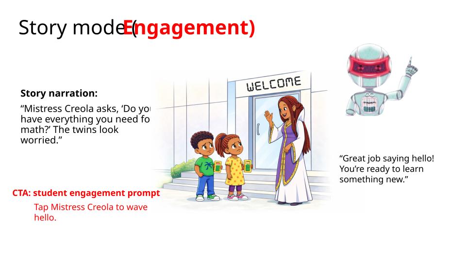

### Content
- Story narration:
“Mistress Creola asks, ‘Do you have everything you need for math?’ The twins look worried.” 
- Tap Mistress Creola to wave hello.
- CTA: student engagement prompt
- “Great job saying hello! You’re ready to learn something new.”
- Story mode (Engagement)

---

## Scene 10
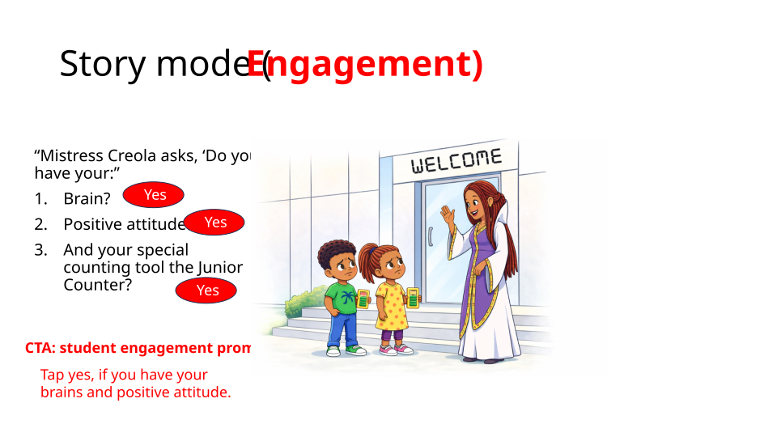

### Content
- “Mistress Creola asks, ‘Do you have your:”
Brain?
Positive attitude?
And your special counting tool the Junior Counter?
- Tap yes, if you have your brains and positive attitude.
- CTA: student engagement prompt
- Yes
- Yes
- Yes
- Story mode (Engagement)

---

## Scene 11
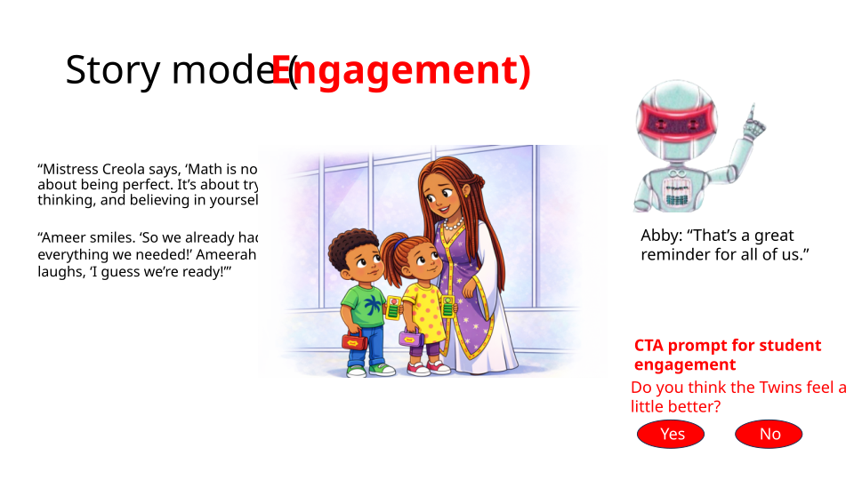

### Content
- “Mistress Creola says, ‘Math is not about being perfect. It’s about trying, thinking, and believing in yourself.’”
- “Ameer smiles. ‘So we already had everything we needed!’ Ameerah laughs, ‘I guess we’re ready!’”
- Abby: “That’s a great reminder for all of us.”
- Do you think the Twins feel a little better?
- CTA prompt for student engagement
- Yes
- No
- Story mode (Engagement)

---

## Scene 12
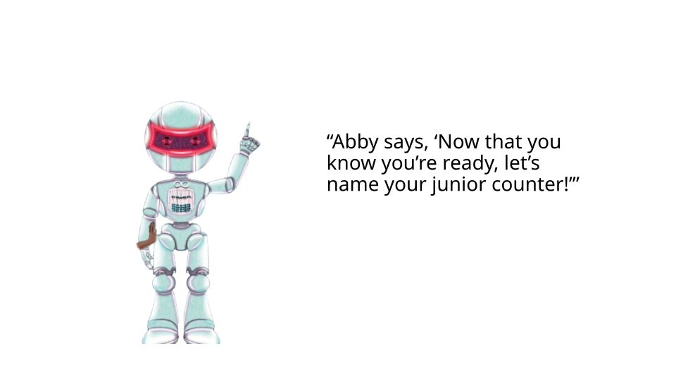

### Content
- “Abby says, ‘Now that you know you’re ready, let’s name your junior counter!’”

---

## Scene 13
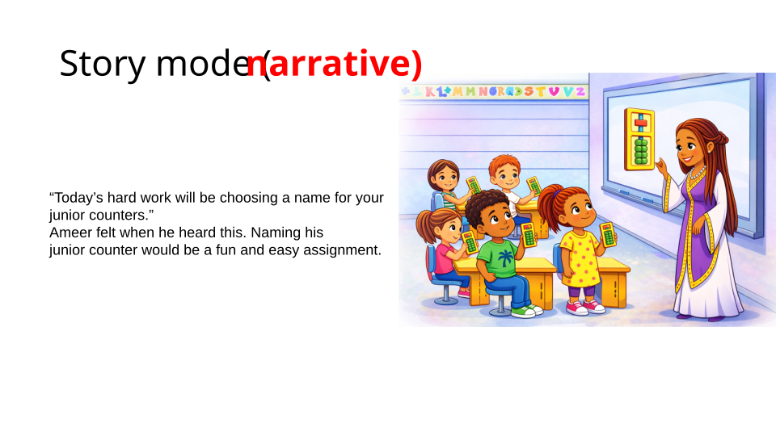

### Content
- “Today’s hard work will be choosing a name for your
junior counters.”
Ameer felt when he heard this. Naming his
junior counter would be a fun and easy assignment.
- Story mode (narrative)

---

## Scene 14
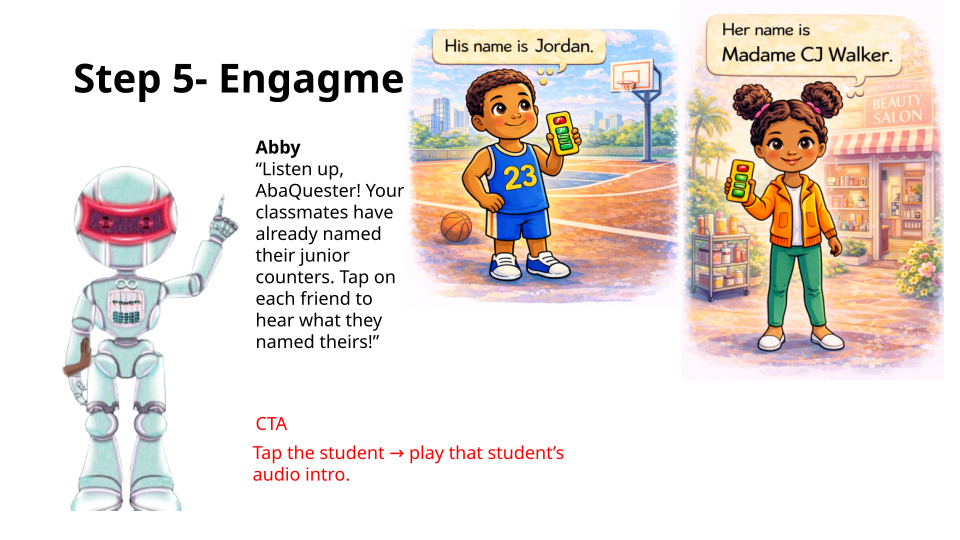

### Content
- Step 5- Engagment
- Abby
“Listen up, AbaQuester! Your classmates have already named their junior counters. Tap on each friend to hear what they named theirs!”
- Tap the student → play that student’s audio intro.

- CTA

### Narrator Script (Cousin's Voice)
> Goal
Let the learner tap on each student to hear what they named their Junior Counter. This reinforces the idea that everyone has one, builds belonging, and models naming before the user names theirs.
1. Screen Setup
Show 4–6 student characters in a grid (2x3 or 3x2).
Each student has:
character image
small speech bubble placeholder
name of their junior counter (optional text after tap)
Abby icon stays bottom-left.
Quest Coin counter stays top-right.
2. User Interaction
Interaction rule:
Tap 1 student → play that student’s audio intro.
Only one student can talk at a time.
If user taps a second student while one is talking, stop the current audio and play the new one.
3. Audio per Student
Each student should have their own short VO line (3–4 seconds max).
Sample lines: on slide

4. Visual Feedback (per tap)
When a student is tapped:
Add glow/pulse around that student’s card
Show their speech bubble with the name in text
Play their audio
Play soft tap SFX: SFX_TAP_01
When audio ends:
remove glow
keep name text visible (so user can re-read)
5. Abby’s Instruction VO (first time)
Play once when slide loads:
Abby VO:
“Listen up, AbaQuester! Your classmates have already named their junior counters. Tap on each friend to hear what they named theirs!”
(If user hasn’t tapped anyone in 5 seconds, replay a shortened prompt:
“Try tapping a friend to hear their counter’s name.”)
6. Reward Logic (Quest Coins)
We want to reward exploration.
Give +1 Quest Coin the first time the user taps a student.
After they’ve listened to all students on the slide, give a bonus +2 Quest Coins and show a mini celebration.
On-screen text:
“Nice! You listened to everyone’s counter names. +2 Quest Coins!”
Abby VO (after all tapped):
“You met everyone’s counters — now you’re ready to name yours!”
7. State Tracking (important)
Dev should track:
student_1_listened = true/false
…
student_6_listened = true/false
all_listened = true → trigger bonus coins + next button highlight
So if the user comes back to the slide, already-played students can show a ✔️ in the corner.
8. Accessibility Notes
Show captions for every student line (short: “I named mine Coco!”)
Make the tappable area big (full card, not just the head)
Don’t overlap audio — stop current before starting new
9. Exit / Continue
“Next” button should stay disabled or low-opacity until:
user taps at least 2 students (minimum exploration)
or (preferred) user taps all students → then highlight “Next”
10. Optional Fun Add-On
After all are heard, Abby can say:
“What about you? What will you name your junior counter?”
→ tap “Name Mine” → go to naming screen.

---

## Scene 15
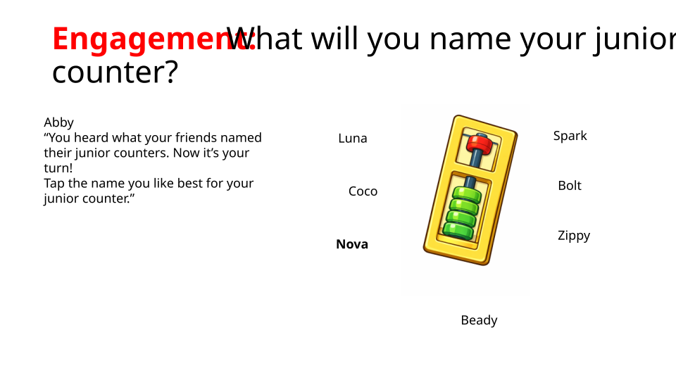

### Content
- Engagement: What will you name your junior counter?
- Coco
- Nova 
- Bolt
- Zippy
- Spark
- Luna
- Beady
- Abby
“You heard what your friends named their junior counters. Now it’s your turn!Tap the name you like best for your junior counter.”

### Narrator Script (Cousin's Voice)
> Dev. Notes:
If no tap after 5 seconds:
“Go ahead and pick a name. You can’t go wrong!”

User Interaction
Tap a name → select it
Selected button gets a green glow or checkmark ✅
Play tap sound: SFX_TAP_01

Quest Coin Reward
We want to reward finishing this “identity” step.
On first successful naming:
Give +2 Quest Coins
Show text:
“You earned 2 Quest Coins for naming your junior counter!”
Play SFX_COIN_CHIME
Animate coins into top-right counter

---

## Scene 16
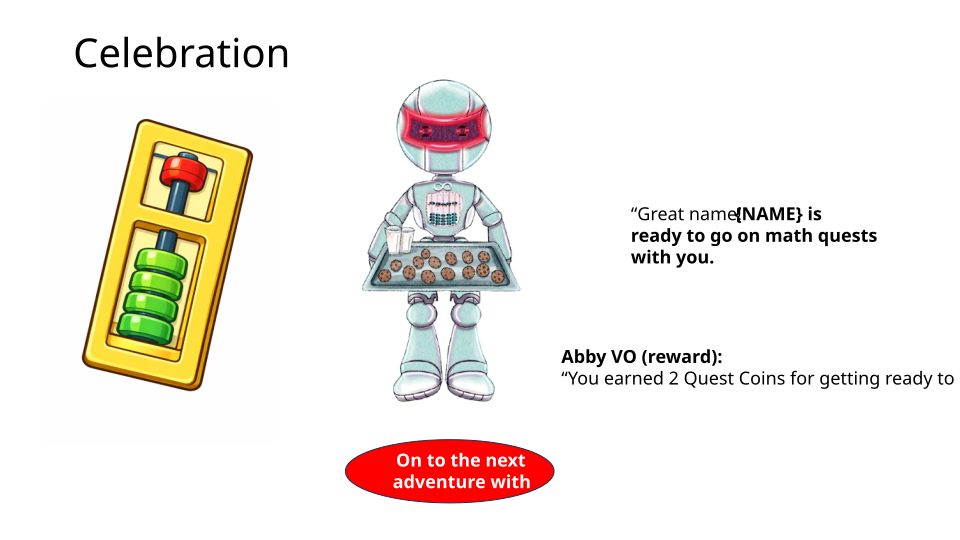

### Content
- Celebration
- On to the next adventure with
- “Great name! {NAME} is ready to go on math quests with you.
- Abby VO (reward):
“You earned 2 Quest Coins for getting ready to learn!”

---

## Scene 17
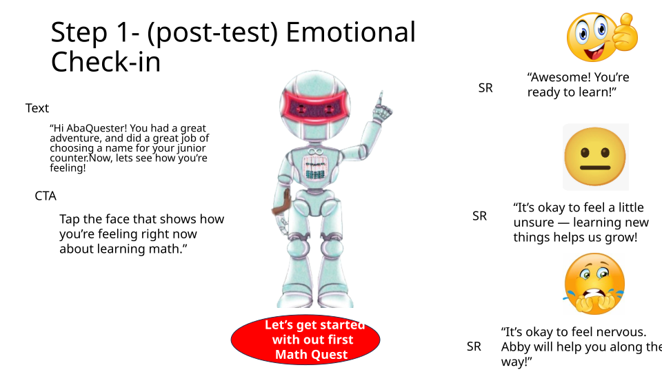

### Content
- Step 1- (post-test) Emotional Check-in
- “Hi AbaQuester! You had a great adventure, and did a great job of choosing a name for your junior counter.  Now, lets see how you’re feeling!
- Tap the face that shows how you’re feeling right now about learning math.”
- CTA
- Text
- Let’s get started with out first Math Quest
- “Awesome! You’re ready to learn!”
- “It’s okay to feel nervous. Abby will help you along the way!”	
- SR
- SR
- “It’s okay to feel a little unsure — learning new things helps us grow!
- SR

---

