# Storyboard Specification: AbaQuest-2 Parts (updated images).pptx

## Scene 1
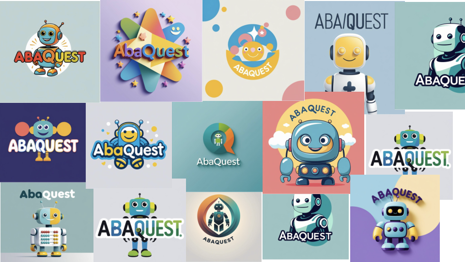

### Content

---

## Scene 2
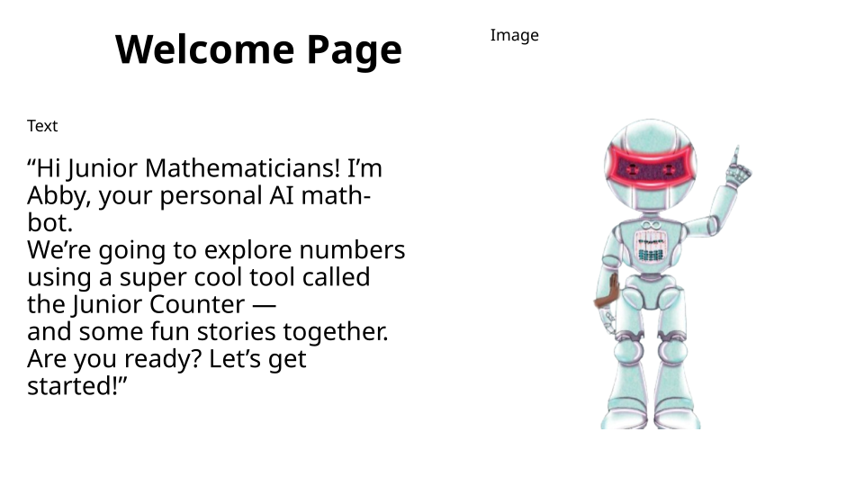

### Content
- Welcome Page
- “Hi Junior Mathematicians! I’m Abby, your personal AI math-bot.We’re going to explore numbers using a super cool tool called the Junior Counter —and some fun stories together. Are you ready? Let’s get started!”
- Text
- Image

### Narrator Script (Cousin's Voice)
> Goal: warm greeting + instant delight + zero confusion.

Welcome ScreenAbby appears in center waving. She says, “Hi AbaQuester! I’m Abby, your VIP AI-bot. Today we’re learning about the parts of the Junior Counter!”Soft background music plays. Junior Counter fades in behind Abby and sparkles.When Abby says “Let’s start our quest,” a large glowing button appears: Start Quest →When clicked, go to the Pre-Test slide.

Outcome: child taps “Let’s get started,” profile/returning state detected, flows to Pretest.
Success metrics: ≥95% of new users reach pretest in ≤30s; abandon rate on welcome <5%.

---

## Scene 3
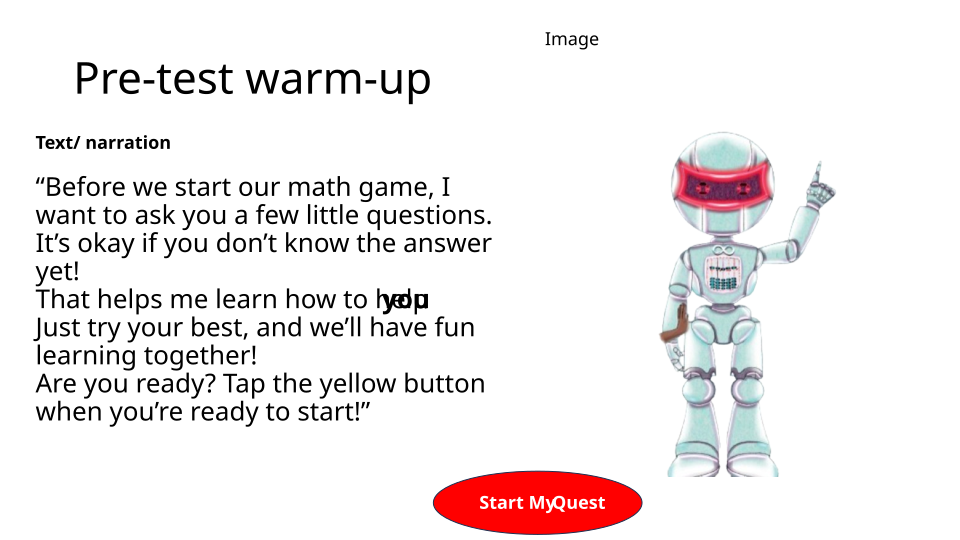

### Content
- Pre-test warm-up
- “Before we start our math game, I want to ask you a few little questions.It’s okay if you don’t know the answer yet!That helps me learn how to help you.Just try your best, and we’ll have fun learning together!Are you ready? Tap the yellow button when you’re ready to start!”
- Text/ narration
- Image
- Start My  Quest 

### Narrator Script (Cousin's Voice)
> Goal: warm greeting + instant delight + zero confusion.
Outcome: child taps “Let’s get started,” profile/returning state detected, flows to Pretest.

Welcome ScreenAbby appears in center waving. She says, “Hi AbaQuester! I’m Abby, your VIP AI-bot. Today we’re learning about the parts of the Junior Counter!”Soft background music plays. Junior Counter fades in behind Abby and sparkles.When Abby says “Let’s start our quest,” a large glowing button appears: Start Quest →When clicked, go to the Pre-Test slide.

Success metrics: ≥95% of new users reach pretest in ≤30s; abandon rate on welcome <5%.

---

## Scene 4
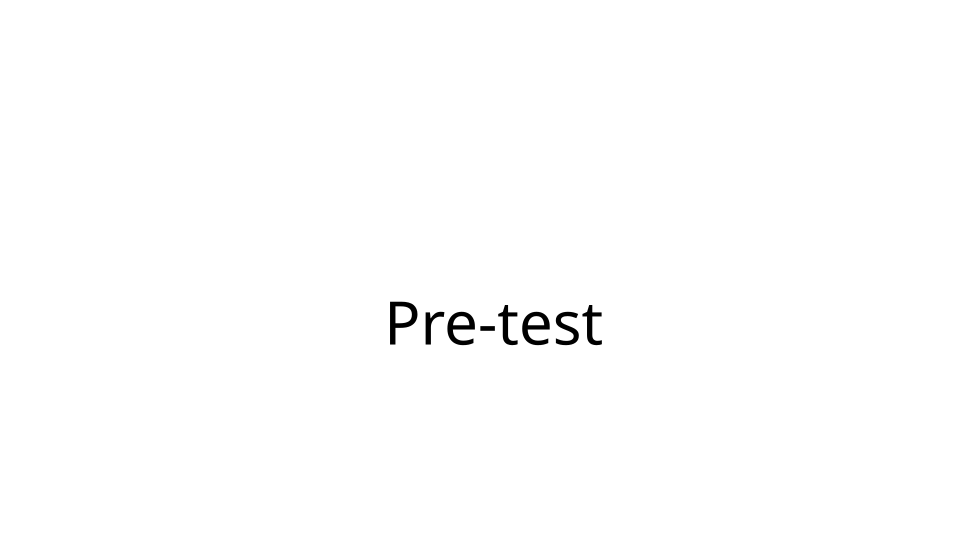

### Content
- Pre-test 

---

## Scene 5
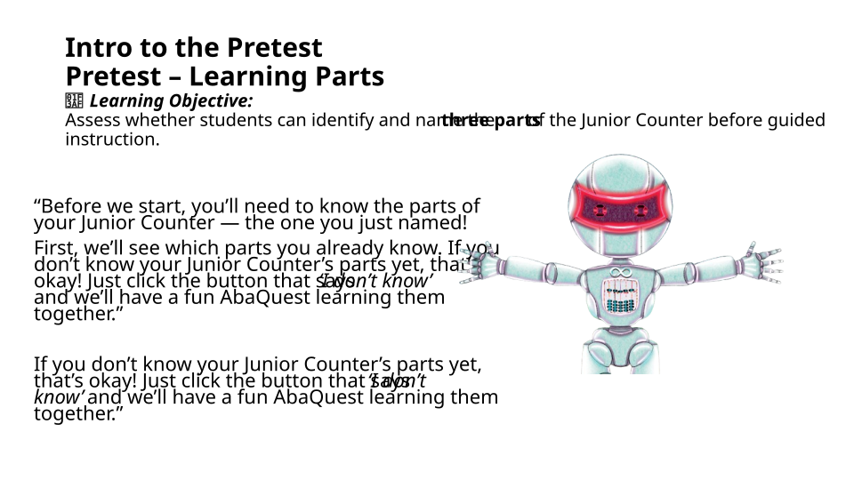

### Content
- Intro to the PretestPretest – Learning Parts🎯Learning Objective:Assess whether students can identify and name the three parts of the Junior Counter before guided instruction.
- “Before we start, you’ll need to know the parts of your Junior Counter — the one you just named! 
First, we’ll see which parts you already know. If you don’t know your Junior Counter’s parts yet, that’s okay! Just click the button that says ‘I don’t know’ and we’ll have a fun AbaQuest learning them together.”

If you don’t know your Junior Counter’s parts yet, that’s okay! Just click the button that says ‘I don’t know’ and we’ll have a fun AbaQuest learning them together.”

### Narrator Script (Cousin's Voice)
> Pre-Test Intro
Developer Instructions:
Scene opens with Abby in the center of the screen, smiling and waving.
A soft background sound plays (calm and encouraging).
Abby speaks clearly and cheerfully:
“Before we start, you’ll need to know the parts of your Junior Counter — the ones you just named! 
First, we’ll see which parts you already know. 

“Start Pre-Test →”
Button should pulse slowly until tapped.
Once clicked, fade out background music and move to the first pre-test question.
Add a replay 🔊 icon in bottom corner so students can re-hear Abby’s instructions.

---

## Scene 6
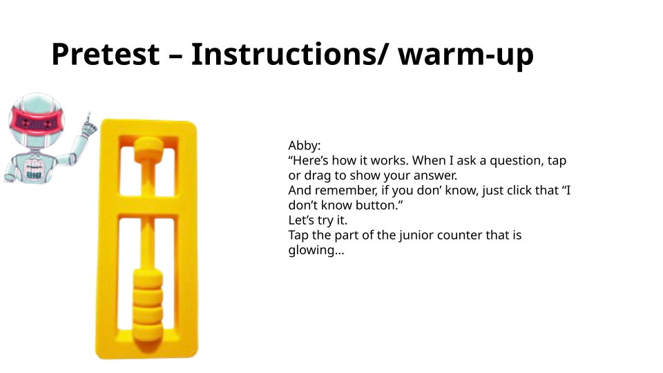

### Content
- Pretest – Instructions/ warm-up
- Abby:
“Here’s how it works. When I ask a question, tap or drag to show your answer.
And remember, if you don’ know, just click that “I don’t know button.”
Let’s try it. 
Tap the part of the junior counter that is glowing…

### Narrator Script (Cousin's Voice)
> Dev. Instruction:
“parts of your Junior Counter,” the counter appears next to her, each section (upper bead, lower beads, answer rod) glowing softly one at a time.
When Abby says “click the button that says ‘I don’t know,’” the purple “I Don’t Know Yet” button fades in and glows briefly.
After her last line, a big button appears at the bottom of the screen that says:

Technical Flow / Developer Notes
a. Keep “Next” button hidden until an answer is selected.
Prevents accidental skipping.
“Next” should only appear after student taps, drags, or selects.
b. Record interaction data:
Log the following per question:
Question ID (e.g., Q1_UpperBead)
Time to first interaction
Type of interaction (tap/drag/I don’t know)
Correct/incorrect choice
These metrics are gold for your SBIR evaluation and future adaptive algorithms.

---

## Scene 7

### Content
- Pretest – “Meet the Junior Counter”Question #1-“Touch the part of the Junior Counter called the upper bead.”
- I don’t know

### Narrator Script (Cousin's Voice)
> Question 1: Identify the Upper Bead
Scene shows 3 Junior Counters side by side, each glowing a different section.
When the student taps the any part of the junior counter:
Log the answer internally (correct/incorrect).
Display a “Next →” button in the bottom right corner.
No correction or hint is given.
When tapped, “Next →” advances to Question 2.

---

## Scene 8
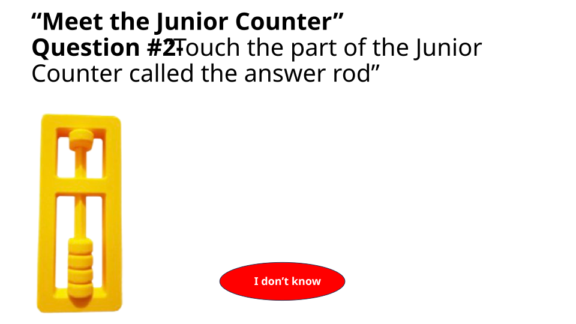

### Content
- “Meet the Junior Counter”Question #2- “Touch the part of the Junior Counter called the answer rod”
- I don’t know

### Narrator Script (Cousin's Voice)
> Question 3: Identify the answer: answer rod
Scene show the Junior Counter 

When the student taps the any part of the junior counter:
Log the answer internally (correct/incorrect).
Display a “Next →” button in the bottom right corner.
No correction or hint is given.
When tapped, “Next →” advances to Question 3.

---

## Scene 9
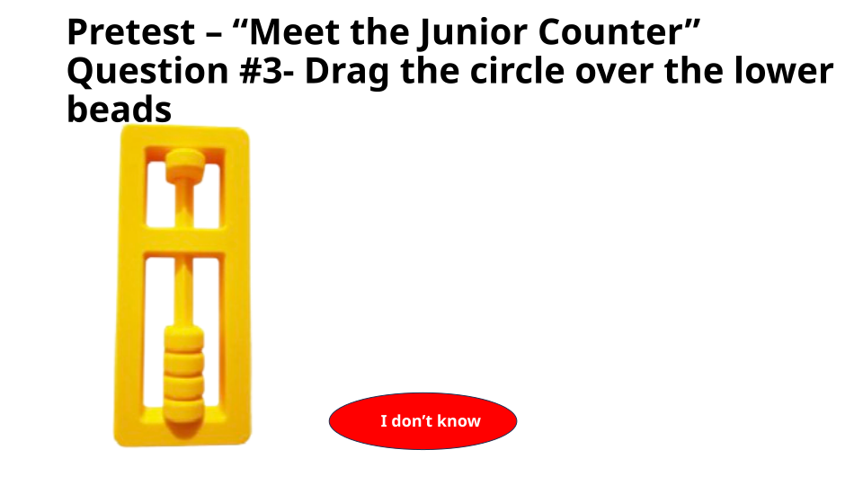

### Content
- Pretest – “Meet the Junior Counter”Question #3- Drag the circle over the lower beads
- I don’t know

### Narrator Script (Cousin's Voice)
> Question 3: Identify the answer lower beads

Scene show the Junior Counter 

When the student taps the any part of the junior counter:
Log the answer internally (correct/incorrect).
Display a “Next →” button in the bottom right corner.
No correction or hint is given.
When tapped, “Next →” advances to Question 2.

---

## Scene 10
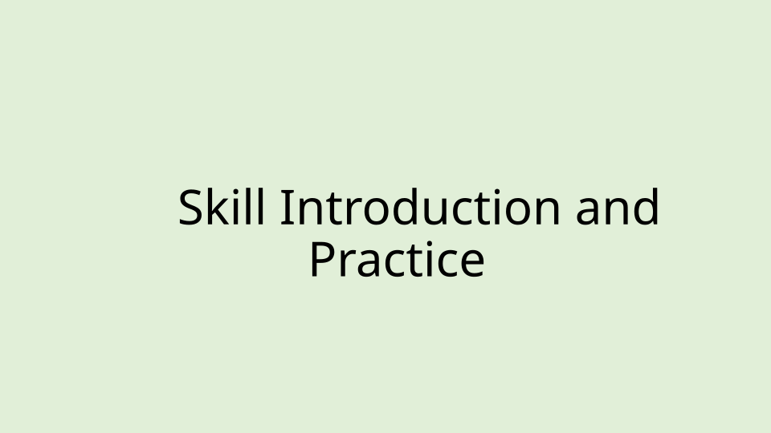

### Content
- Skill Introduction and Practice

---

## Scene 11
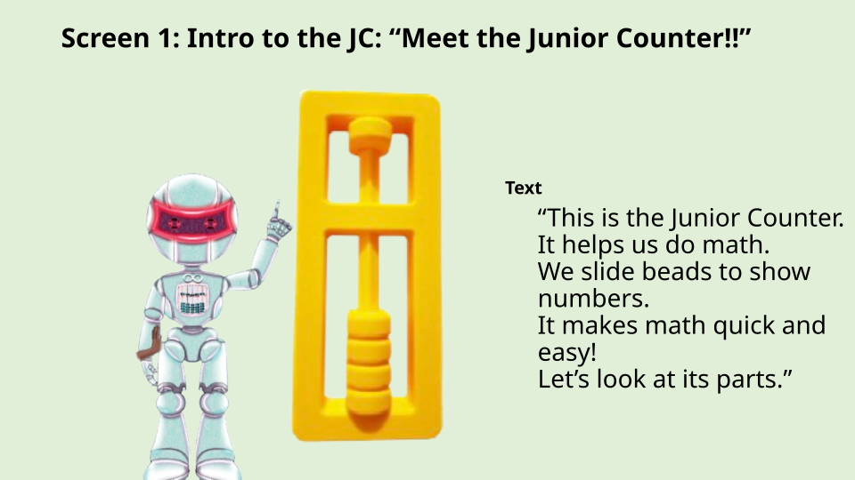

### Content
- Screen 1: Intro to the JC: “Meet the Junior Counter!!” 
- “This is the Junior Counter. It helps us do math.We slide beads to show numbers.It makes math quick and easy!Let’s look at its parts.”
- Text

### Narrator Script (Cousin's Voice)
> 1) Screens & Sequence 
Intro Screen: “Meet the Junior Counter” (static image + Abby VO).
Parts Carousel: 3 mini slides (Upper Bead, Lower Beads, Answer Rod).
Touch & Move Practice: 3 quick interactions (one per part).
Success Wrap: Small celebration; advance button.

Skill Intro & Practice — Skill 1 (Identify Parts)Goal: Kids meet the Junior Counter, learn its 3 parts, and successfully touch/move each part once.Exit condition: Child correctly identifies/touches each part at least once; proceed to Story or Pretest next.Pilot scope: Simple animations + basic audio/captions; no fancy adaptivity needed.

---

## Scene 12
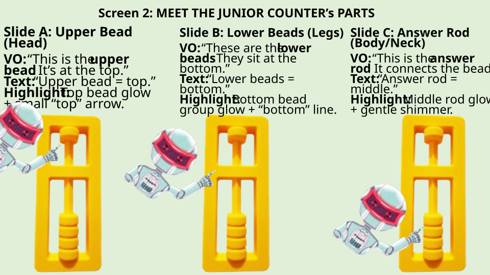

### Content
- Screen 2: MEET THE JUNIOR COUNTER’s PARTS
- Slide A: Upper Bead (Head)
VO: “This is the upper bead. It’s at the top.”Text: “Upper bead = top.”Highlight: Top bead glow + small “top” arrow.
- Slide B: Lower Beads (Legs)
VO: “These are the lower beads. They sit at the bottom.”Text: “Lower beads = bottom.”Highlight: Bottom bead group glow + “bottom” line.

- Slide C: Answer Rod (Body/Neck)
VO: “This is the answer rod. It connects the beads.”Text: “Answer rod = middle.”Highlight: Middle rod glow + gentle shimmer.

### Narrator Script (Cousin's Voice)
> Slide A: Upper Bead (Head)
VO: “This is the upper bead. It’s at the top.”Text: “Upper bead = top.”Highlight: Top bead glow + small “top” arrow.

Slide B: Lower Beads (Legs)
VO: “These are the lower beads. They sit at the bottom.”Text: “Lower beads = bottom.”Highlight: Bottom bead group glow + “bottom” line.

Slide C: Answer Rod (Body/Neck)
VO: “This is the answer rod. It connects the beads.”Text: “Answer rod = middle.”Highlight: Middle rod glow + gentle shimmer.

Carousel controls:
Left/Right arrows (large), progress dots (3).
Skip (small link) → goes to Practice.

---

## Scene 13
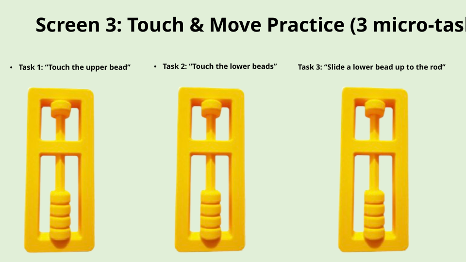

### Content
- Screen 3: Touch & Move Practice (3 micro-tasks)
- Task 1: “Touch the upper bead”

- Task 2: “Touch the lower beads”

- Task 3: “Slide a lower bead up to the rod”

### Narrator Script (Cousin's Voice)
> Task 1: “Touch the upper bead”
Prompt VO: “Touch the upper bead.”
Input: Tap on the upper bead area.
Correct response: Bead lights up + “click” SFX + Abby: “Yes, that’s the upper bead!”– you get a Quest Coin
Miss tap: Soft nudge glow on the correct bead + Abby: “Try the bead at the top.”
IDK button: Logs skip, show quick hint; move on after 5s.

Task 2: “Touch the lower beads”
VO: “Touch the lower beads at the bottom.”
Correct: Bottom group glows + “click” SFX + Abby praise.--!”– you get a Quest Coin
Miss/IDK: As above with the bottom hint.

Task 3: “Slide a lower bead up to the rod”
VO: “Now, slide one lower bead up to the answer rod.”
Input: Drag one bottom bead upward until it touches the rod.
Correct: Snap to rod, “slide” SFX, tiny confetti; Abby: “Great sliding! That’s the answer rod.” --!”– you get a Quest Coin
If tap instead of drag: Show finger-drag ghost animation.
IDK: Auto demo animation, then ask learner to try once.

UI elements (all tasks):
🔊 Speaker icon to replay prompt.
🟠 “I don’t know yet” button (same size as options, bottom left).
🟢 Next button appears only after success or skip.

Done = done: Each task can be completed with one simple action; every action logs; latency <50ms.

---

## Scene 14
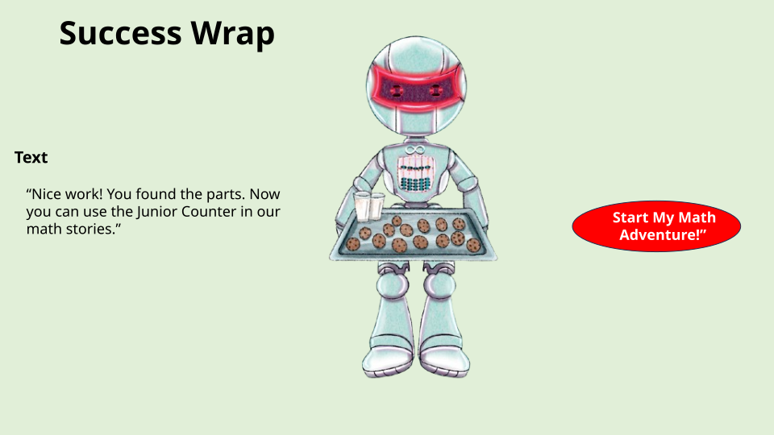

### Content
- Success Wrap
- “Nice work! You found the parts. Now you can use the Junior Counter in our math stories.”
- Text
- Start My Math Adventure!” 

### Narrator Script (Cousin's Voice)
> 5) Screen 4 — Success Wrap
VO: “Nice work! You found the parts. Now you can use the Junior Counter in our math stories.”UI: Big button “Start My Math Adventure!” (or “Begin Questions” if you’re going to the pretest next).Micro-celebration: 1-second sparkle; no heavy fireworks (pilot perf).

---

## Scene 15

### Content
- Story Mode

---

## Scene 16
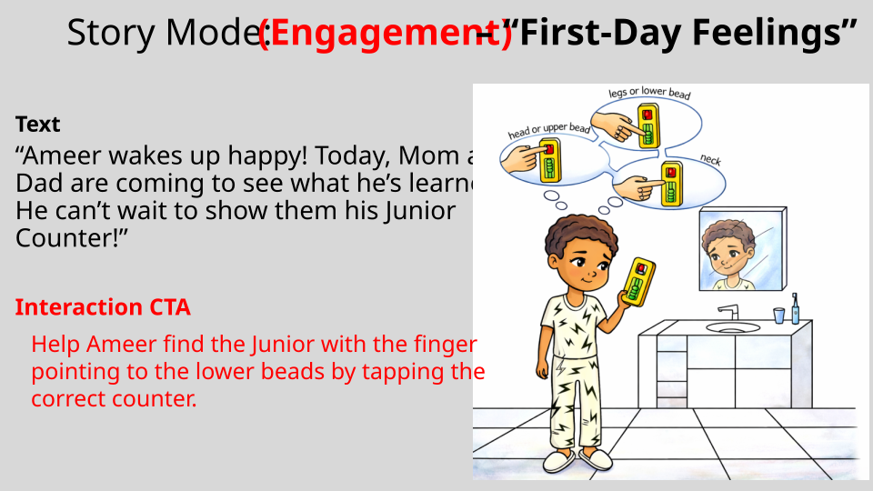

### Content
- Story Mode: (Engagement) – “First-Day Feelings”
- “Ameer wakes up happy! Today, Mom and Dad are coming to see what he’s learned. He can’t wait to show them his Junior Counter!”
- Text
- Interaction CTA
- Help Ameer find the Junior with the finger pointing to the lower beads by tapping the correct counter.

---

## Scene 17
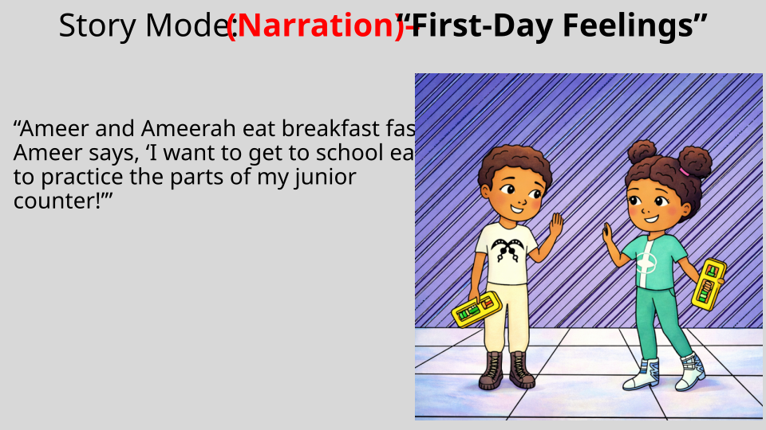

### Content
- Story Mode: (Narration)– “First-Day Feelings”
- “Ameer and Ameerah eat breakfast fast. Ameer says, ‘I want to get to school early to practice the parts of my junior counter!’”

---

## Scene 18
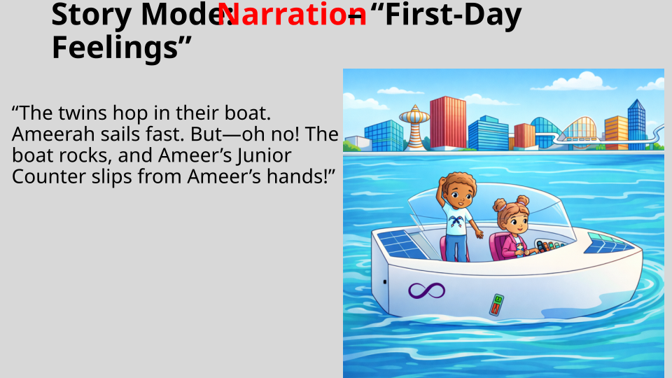

### Content
- Story Mode: Narration – “First-Day Feelings”
- “The twins hop in their boat. Ameerah sails fast. But—oh no! The boat rocks, and Ameer’s Junior Counter slips from Ameer’s hands!”

---

## Scene 19
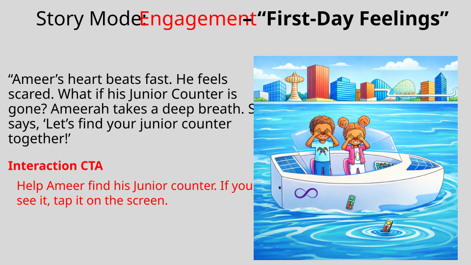

### Content
- Story Mode: Engagement – “First-Day Feelings”
- “Ameer’s heart beats fast. He feels scared. What if his Junior Counter is gone? Ameerah takes a deep breath. She says, ‘Let’s find your junior counter together!’
- Interaction CTA
- Help Ameer find his Junior counter. If you see it, tap it on the screen.

### Narrator Script (Cousin's Voice)
> When use touches the junior counter- The win a Quest Coin

---

## Scene 20
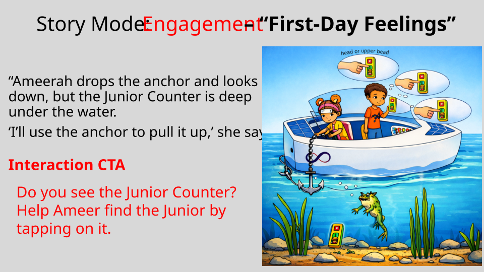

### Content
- Story Mode: Engagement– “First-Day Feelings”
- “Ameerah drops the anchor and looks down, but the Junior Counter is deep under the water. 
‘I’ll use the anchor to pull it up,’ she says.
- Interaction CTA
- Do you see the Junior Counter? Help Ameer find the Junior by tapping on it. 

### Narrator Script (Cousin's Voice)
> When use touches the junior counter- The win a Quest Coin

---

## Scene 21
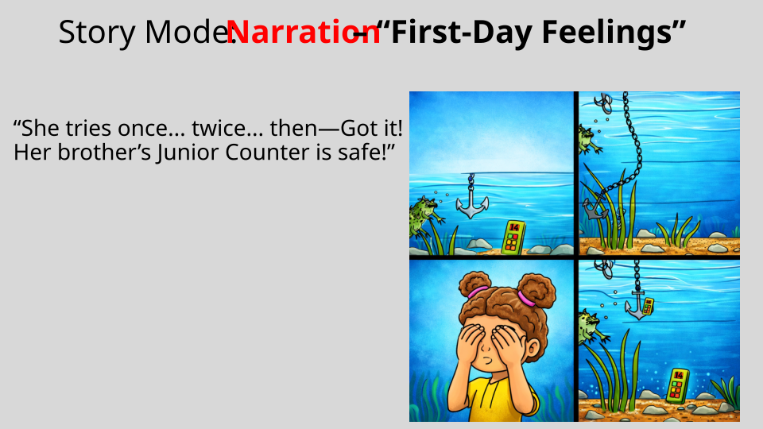

### Content
- Story Mode: Narration– “First-Day Feelings”
- “She tries once... twice... then—Got it! Her brother’s Junior Counter is safe!”

---

## Scene 22
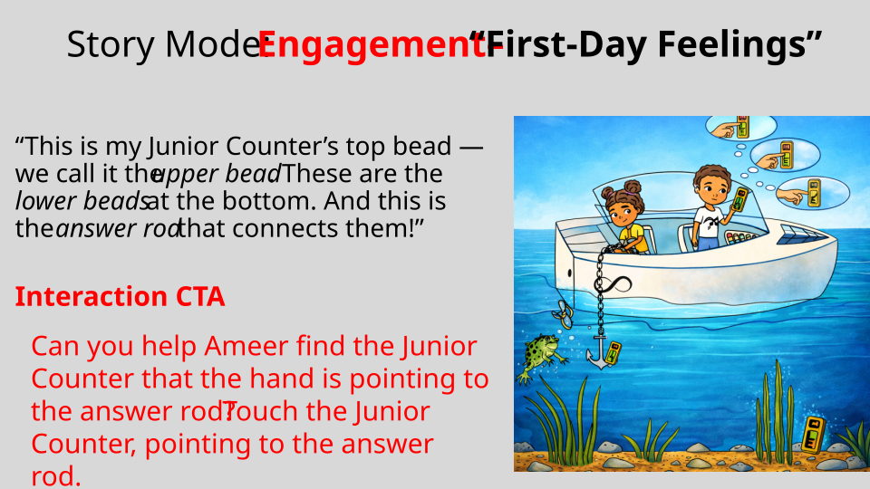

### Content
- Story Mode: Engagement– “First-Day Feelings”
- “This is my Junior Counter’s top bead — we call it the upper bead. These are the lower beads at the bottom. And this is the answer rod that connects them!”
- Interaction CTA
- Can you help Ameer find the Junior Counter that the hand is pointing to the answer rod?  Touch the Junior Counter, pointing to the answer rod.

### Narrator Script (Cousin's Voice)
> When user touches the correct counter- the win a Quest Coin

---

## Scene 23

### Content
- Story Mode: Narration– “First-Day Feelings”
- “Ameer and Ameerah hurry to school with big smiles. 
They can’t wait to show what they’ve learned!” 
“Oh no! Mistress Creola waves from the door. She says, ‘Sorry, class is closed today! I have to go to the dentist.’” Abby adds gently: “Ameer feels a little sad—but also proud. He worked hard and learned so much!

---

## Scene 24
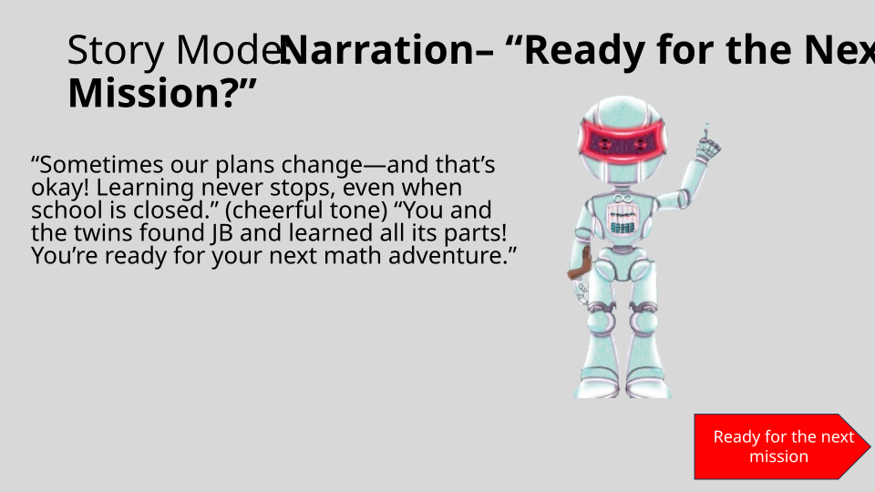

### Content
- Story Mode: Narration– “Ready for the Next Mission?”
- “Sometimes our plans change—and that’s okay! Learning never stops, even when school is closed.” (cheerful tone) “You and the twins found JB and learned all its parts! You’re ready for your next math adventure.”
- Ready for the next mission

---

## Scene 25
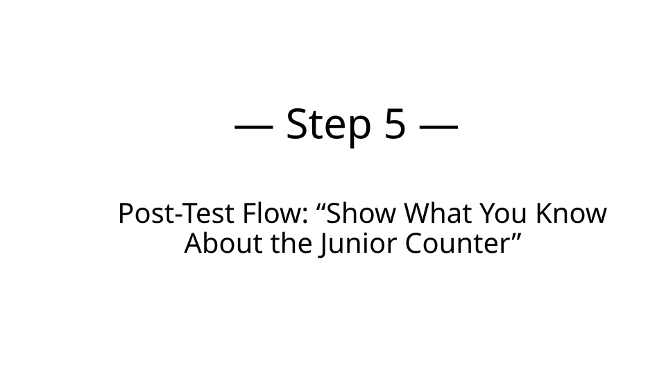

### Content
- — Step 5 — 
- Post-Test Flow: “Show What You Know About the Junior Counter”

---

## Scene 26
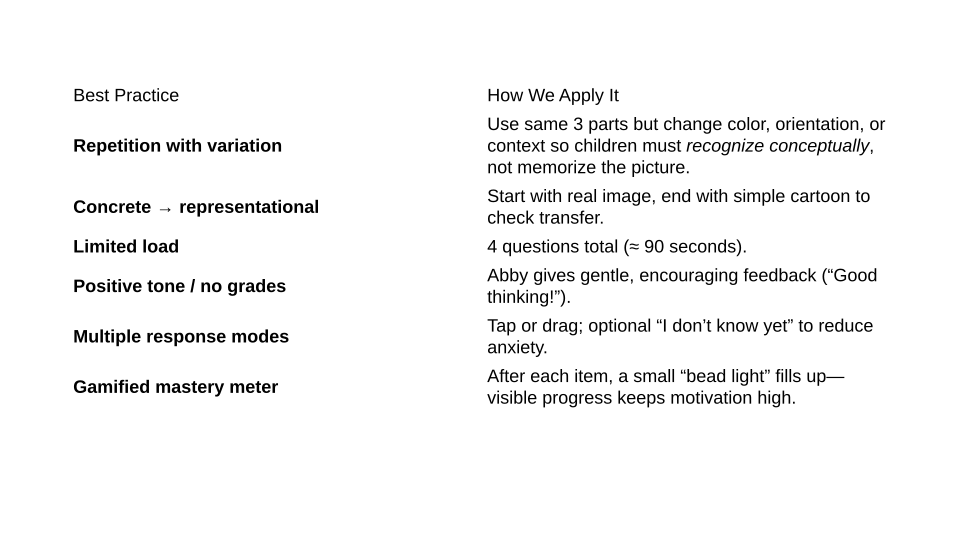

### Content

---

## Scene 27
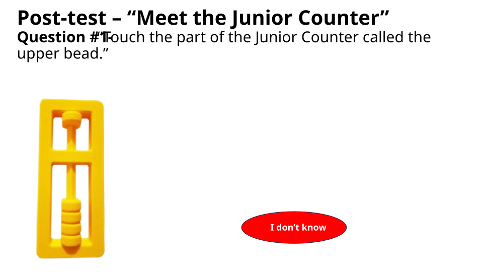

### Content
- Post-test – “Meet the Junior Counter”Question #1-“Touch the part of the Junior Counter called the upper bead.”
- I don’t know

### Narrator Script (Cousin's Voice)
> Question 1: Identify the Upper Bead
Scene shows 3 Junior Counters side by side, each glowing a different section.
When the student taps the any part of the junior counter:
Log the answer internally (correct/incorrect).
Display a “Next →” button in the bottom right corner.
No correction or hint is given.
When tapped, “Next →” advances to Question 2.

---

## Scene 28
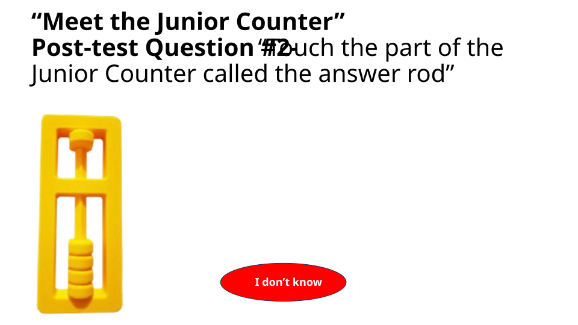

### Content
- “Meet the Junior Counter”Post-test Question #2- “Touch the part of the Junior Counter called the answer rod”
- I don’t know

### Narrator Script (Cousin's Voice)
> Question 3: Identify the answer: answer rod
Scene show the Junior Counter 

When the student taps the any part of the junior counter:
Log the answer internally (correct/incorrect).
Display a “Next →” button in the bottom right corner.
No correction or hint is given.
When tapped, “Next →” advances to Question 3.

---

## Scene 29
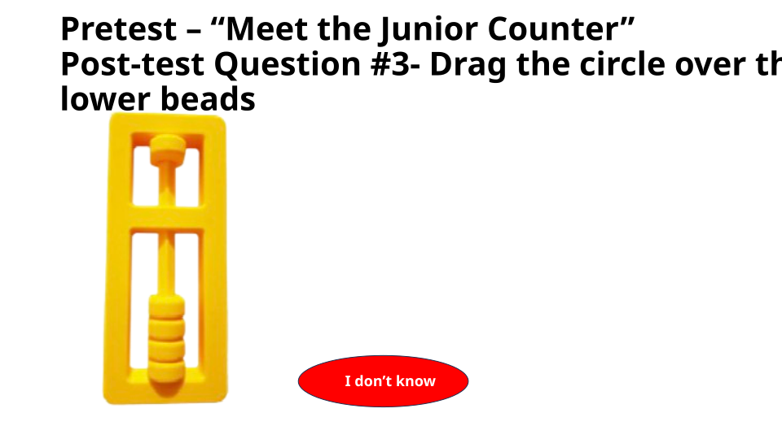

### Content
- Pretest – “Meet the Junior Counter”Post-test Question #3- Drag the circle over the lower beads
- I don’t know

### Narrator Script (Cousin's Voice)
> Question 3: Identify the answer lower beads

Scene show the Junior Counter 

When the student taps the any part of the junior counter:
Log the answer internally (correct/incorrect).
Display a “Next →” button in the bottom right corner.
No correction or hint is given.
When tapped, “Next →” advances to Question 2.

---

## Scene 30
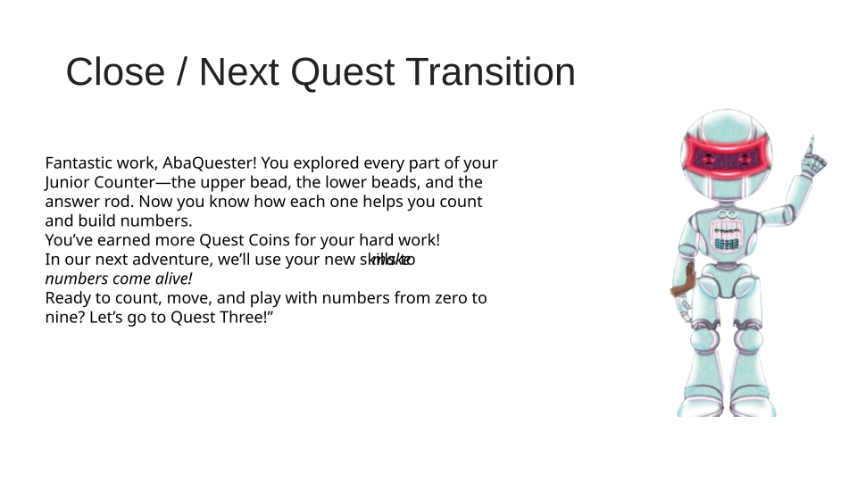

### Content
- Close / Next Quest Transition
- Fantastic work, AbaQuester! You explored every part of your Junior Counter—the upper bead, the lower beads, and the answer rod. Now you know how each one helps you count and build numbers.
You’ve earned more Quest Coins for your hard work!
In our next adventure, we’ll use your new skills to make numbers come alive!
Ready to count, move, and play with numbers from zero to nine? Let’s go to Quest Three!”

### Narrator Script (Cousin's Voice)
> AbaQuest 2 – Close / Next Transition Scene
Scene Description (for developer):
Background: calm “river bottom” or classroom scene matching earlier artwork.
Abby stands beside the Junior Counter, smiling proudly.
Text on top: “Quest 2 Complete!”
Confetti animation or gentle sparkles across the screen.
Two Quest Coins float upward into the top-right coin counter.
Abby’s voice plays automatically, then the “Start Quest 3 →” button appears.

Developer Notes (plain instructions):
Show “Quest 2 Complete!” text fade in, followed by Abby animation (small wave).
Two Quest Coins spin and float into coin counter → increment coin total by +2.
Soft success chime plays under Abby’s dialogue.
After her last line, fade in “Start Quest 3 →” button at bottom.
When tapped → fade transition to AbaQuest 3 Welcome screen.
Log event: {quest_complete:2, coins_earned:2, time_stamp}
Include replay 🔊 button for Abby’s closing voice line.

---

