# Storyboard Specification: AbaQuest-3 Positioning Numbers 0, 1, 5 and 9) (Updated images) .pptx

## Scene 1

### Content

---

## Scene 2

### Content
- Quest 3

---

## Scene 3
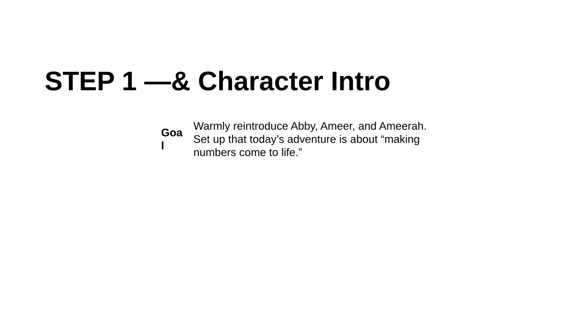

### Content
- STEP 1 —& Character Intro

---

## Scene 4
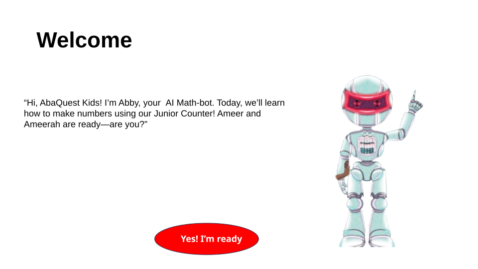

### Content
- Welcome
- Yes! I’m ready

---

## Scene 5
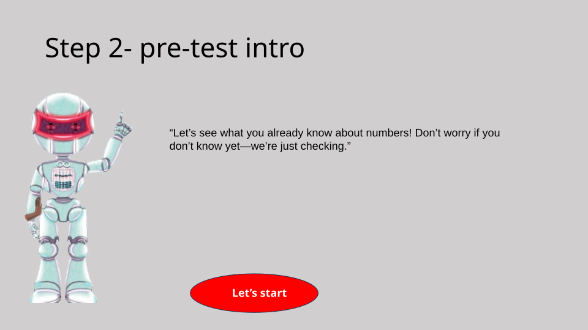

### Content
- Step 2- pre-test intro
- Let’s start

---

## Scene 6
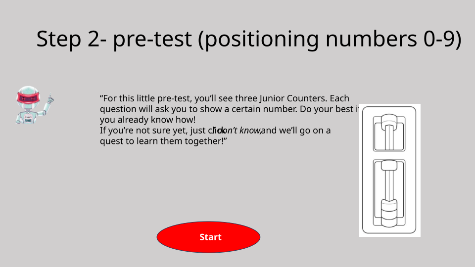

### Content
- Step 2- pre-test (positioning numbers 0-9)
- “For this little pre-test, you’ll see three Junior Counters. Each question will ask you to show a certain number. Do your best if you already know how!
If you’re not sure yet, just click I don’t know, and we’ll go on a quest to learn them together!”

- Start

---

## Scene 7
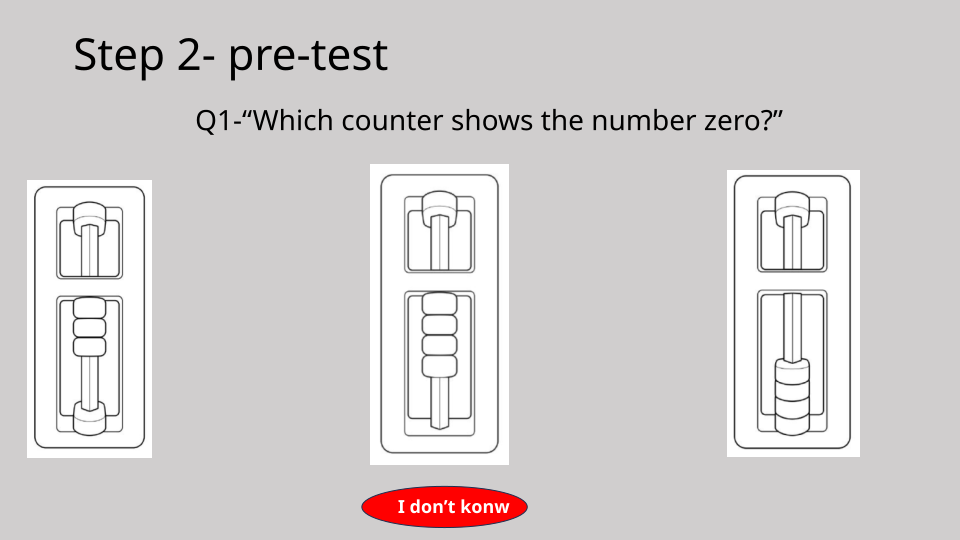

### Content
- Step 2- pre-test
- Q1-“Which counter shows the number zero?”
- I don’t konw

---

## Scene 8
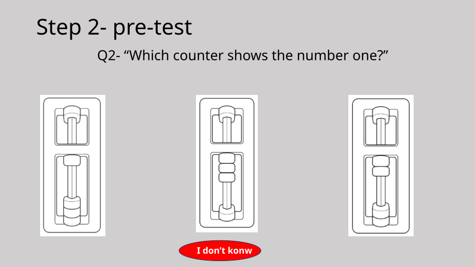

### Content
- Step 2- pre-test
- Q2- “Which counter shows the number one?”
- I don’t konw

---

## Scene 9
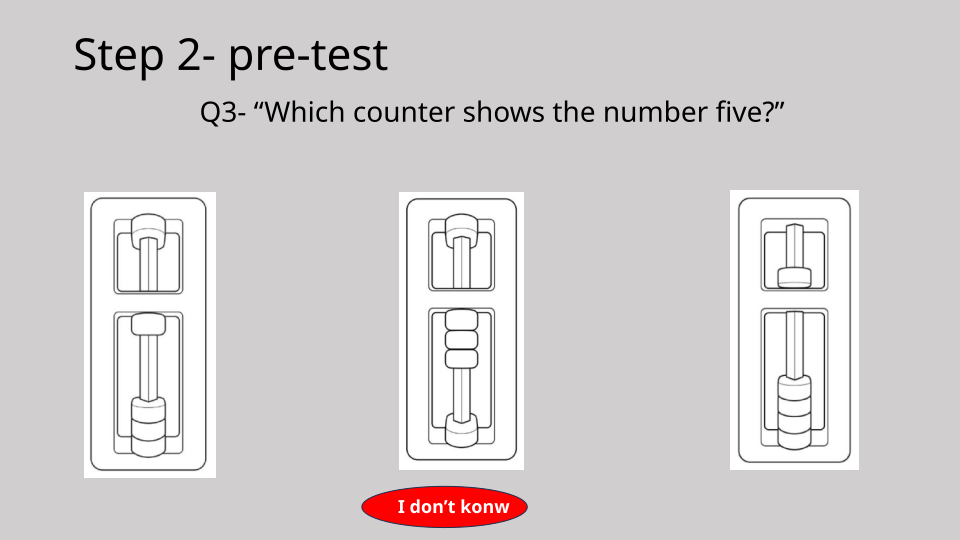

### Content
- Step 2- pre-test
- Q3- “Which counter shows the number five?”
- I don’t konw

---

## Scene 10
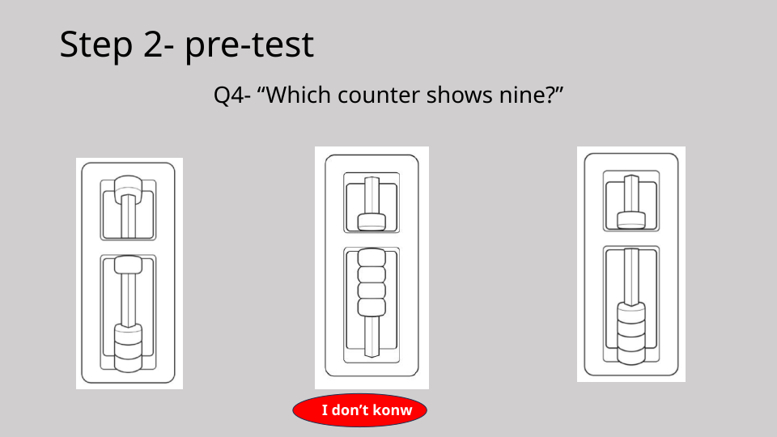

### Content
- Step 2- pre-test
- Q4- “Which counter shows nine?”
- I don’t konw

---

## Scene 11
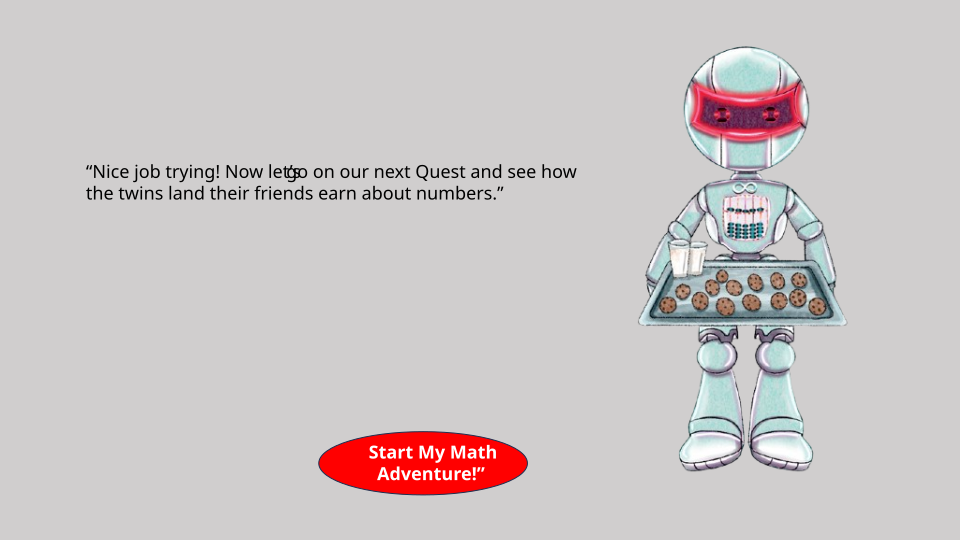

### Content
- “Nice job trying! Now let’s  go on our next Quest and see how the twins land their friends earn about numbers.”
- Start My Math Adventure!” 

---

## Scene 12
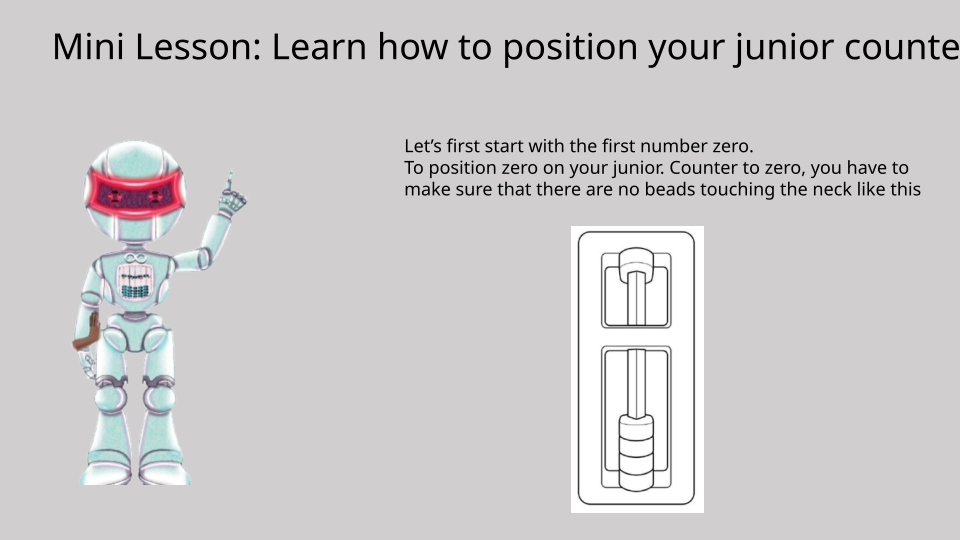

### Content
- Let’s first start with the first number zero. 
To position zero on your junior. Counter to zero, you have to make sure that there are no beads touching the neck like this
- Mini Lesson: Learn how to position your junior counter to ‘0’

### Narrator Script (Cousin's Voice)
> Feedback: great job, you’re really good at this, you’re a natural, I’m impressed, are you using AI?, did you google that answer

Wrong feedback: try again, that was super close, not quick, take a deep breath and think about it and try again.

---

## Scene 13
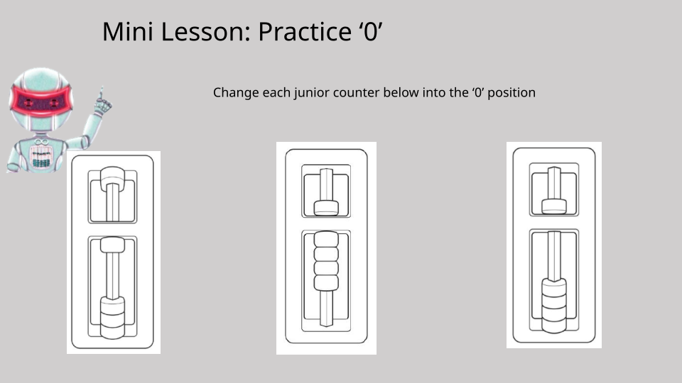

### Content
- Mini Lesson: Practice ‘0’
- Change each junior counter below into the ‘0’ position

### Narrator Script (Cousin's Voice)
> Feedback: great job, you’re really good at this, you’re a natural, I’m impressed, are you using AI?, did you google that answer

Wrong feedback: try again, that was super close, not quick, take a deep breath and think about it and try again.

One Quest Coin for each right answer

---

## Scene 14
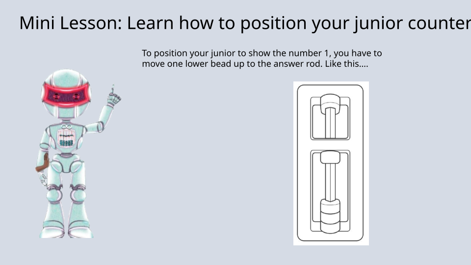

### Content
- To position your junior to show the number 1, you have to move one lower bead up to the answer rod. Like this….
- Mini Lesson: Learn how to position your junior counter to ‘1’

---

## Scene 15
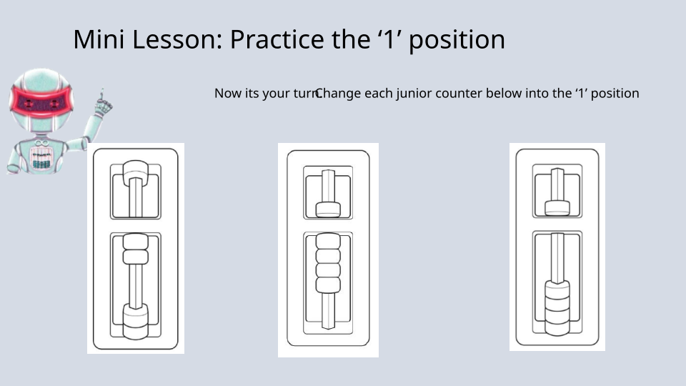

### Content
- Mini Lesson: Practice the ‘1’ position
- Now its your turn.  Change each junior counter below into the ‘1’ position

### Narrator Script (Cousin's Voice)
> Feedback: great job, you’re really good at this, you’re a natural, I’m impressed, are you using AI?, did you google that answer

Wrong feedback: try again, that was super close, not quick, take a deep breath and think about it and try again.

One Quest Coin for each right answer

---

## Scene 16
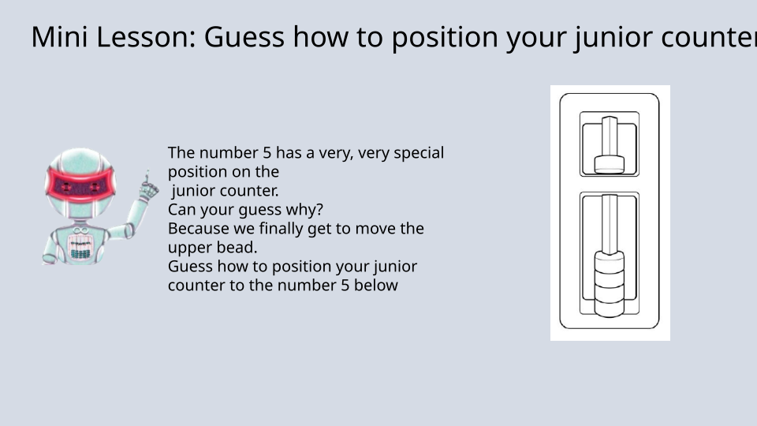

### Content
- The number 5 has a very, very special position on the
 junior counter. 
Can your guess why?
Because we finally get to move the upper bead.
Guess how to position your junior counter to the number 5 below
- Mini Lesson: Guess how to position your junior counter to ‘5’

---

## Scene 17
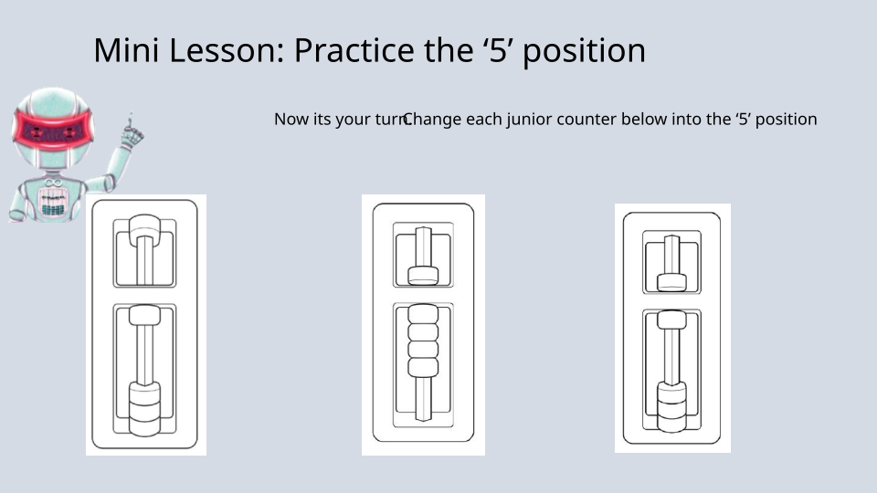

### Content
- Mini Lesson: Practice the ‘5’ position
- Now its your turn.  Change each junior counter below into the ‘5’ position

### Narrator Script (Cousin's Voice)
> Feedback: great job, you’re really good at this, you’re a natural, I’m impressed, are you using AI?, did you google that answer

Wrong feedback: try again, that was super close, not quick, take a deep breath and think about it and try again.

One Quest Coin for each right answer

---

## Scene 18
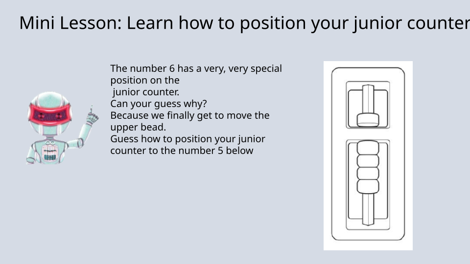

### Content
- The number 6 has a very, very special position on the
 junior counter. 
Can your guess why?
Because we finally get to move the upper bead.
Guess how to position your junior counter to the number 5 below
- Mini Lesson: Learn how to position your junior counter to ‘9’

---

## Scene 19
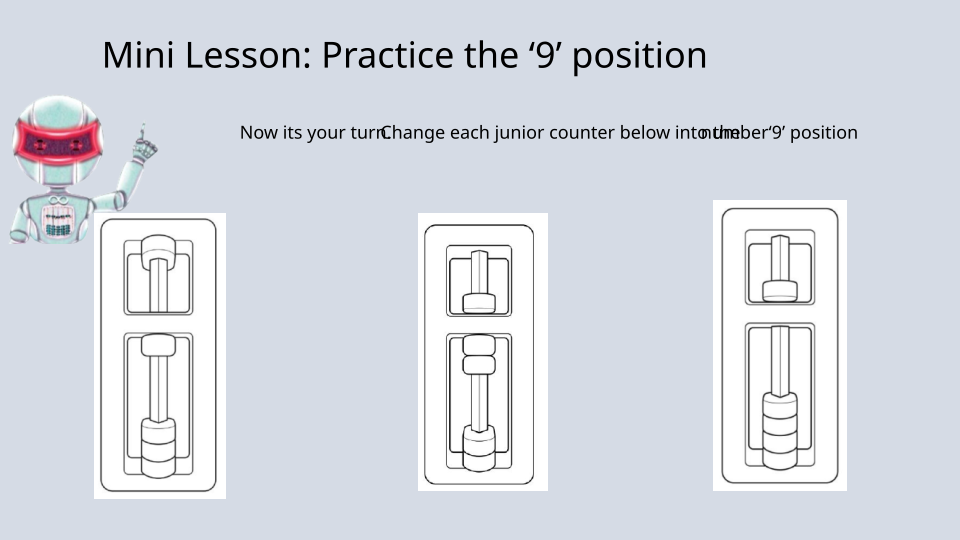

### Content
- Mini Lesson: Practice the ‘9’ position
- Now its your turn.  Change each junior counter below into the  number‘9’ position

### Narrator Script (Cousin's Voice)
> Feedback: great job, you’re really good at this, you’re a natural, I’m impressed, are you using AI?, did you google that answer

Wrong feedback: try again, that was super close, not quick, take a deep breath and think about it and try again.

One Quest Coin for each right answer

---

## Scene 20
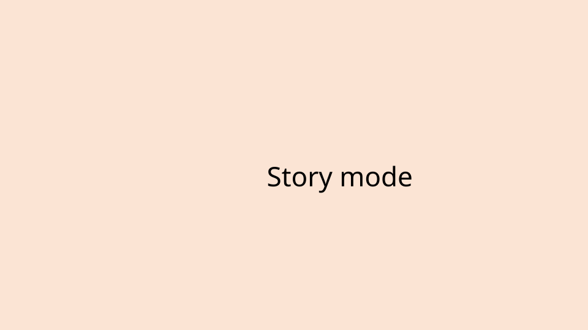

### Content
- Story mode

---

## Scene 21
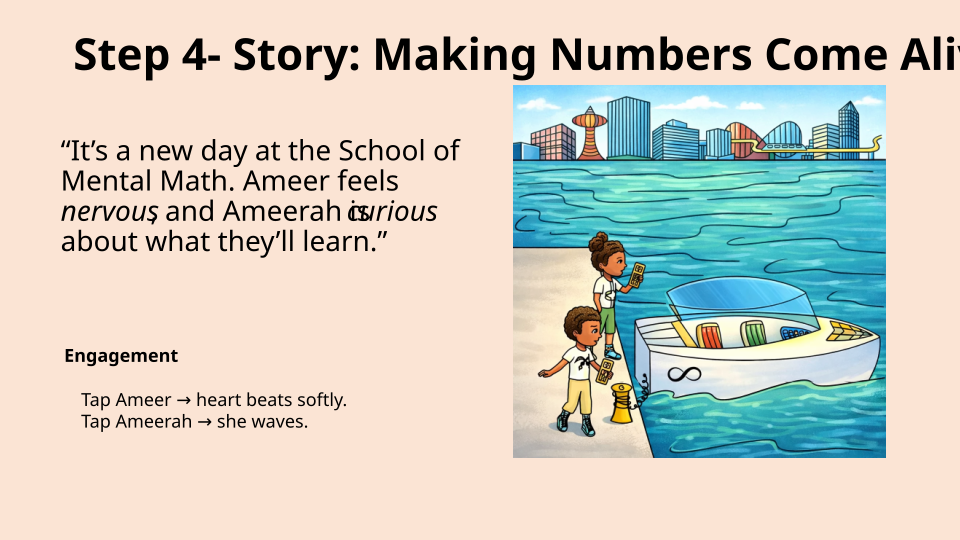

### Content
- Step 4- Story: Making Numbers Come Alive
- “It’s a new day at the School of Mental Math. Ameer feels nervous, and Ameerah is curious about what they’ll learn.”
- Engagement
- Tap Ameer → heart beats softly. Tap Ameerah → she waves.

---

## Scene 22
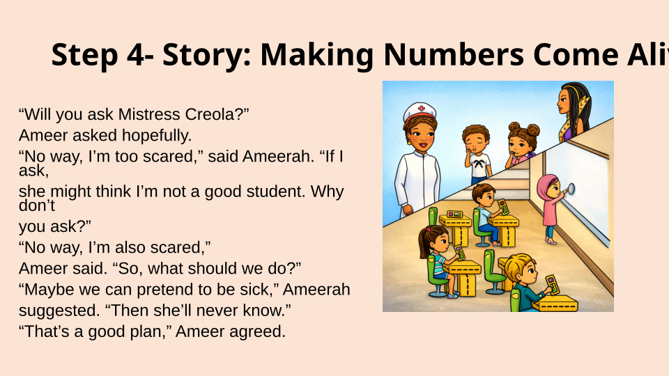

### Content
- Step 4- Story: Making Numbers Come Alive
- “Will you ask Mistress Creola?”
Ameer asked hopefully.
“No way, I’m too scared,” said Ameerah. “If I ask,
she might think I’m not a good student. Why don’t
you ask?”
“No way, I’m also scared,”
Ameer said. “So, what should we do?”
“Maybe we can pretend to be sick,” Ameerah
suggested. “Then she’ll never know.”
“That’s a good plan,” Ameer agreed.

---

## Scene 23
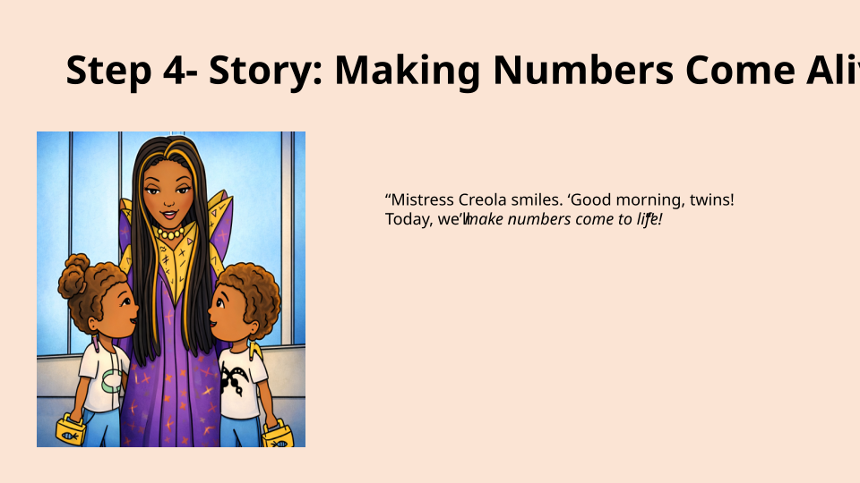

### Content
- Step 4- Story: Making Numbers Come Alive
- “Mistress Creola smiles. ‘Good morning, twins! 
Today, we’ll make numbers come to life!’”

---

## Scene 24
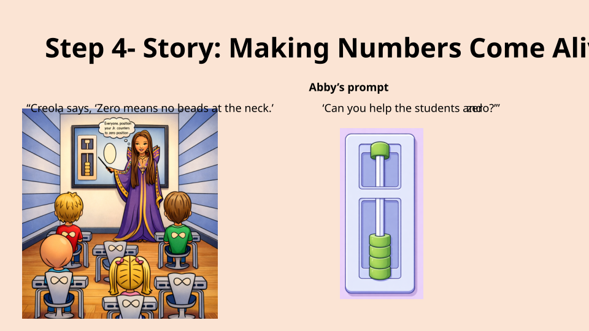

### Content
- Step 4- Story: Making Numbers Come Alive (0)
- “Creola says, ‘Zero means no beads at the neck.’ 

- ‘Can you help the students and  zero?’”
- Abby’s prompt

---

## Scene 25
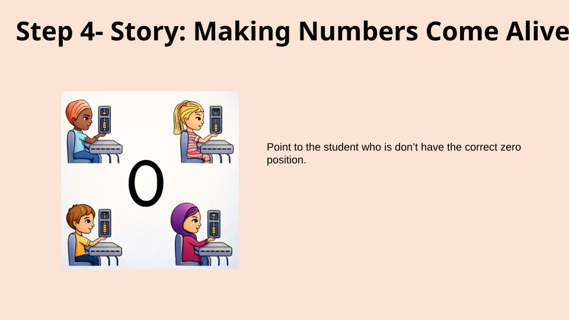

### Content
- Point to the student who is don’t have the correct zero position.
- Step 4- Story: Making Numbers Come Alive (0)

### Narrator Script (Cousin's Voice)
> You are doing a great job helping! You get a Quest Coin

---

## Scene 26
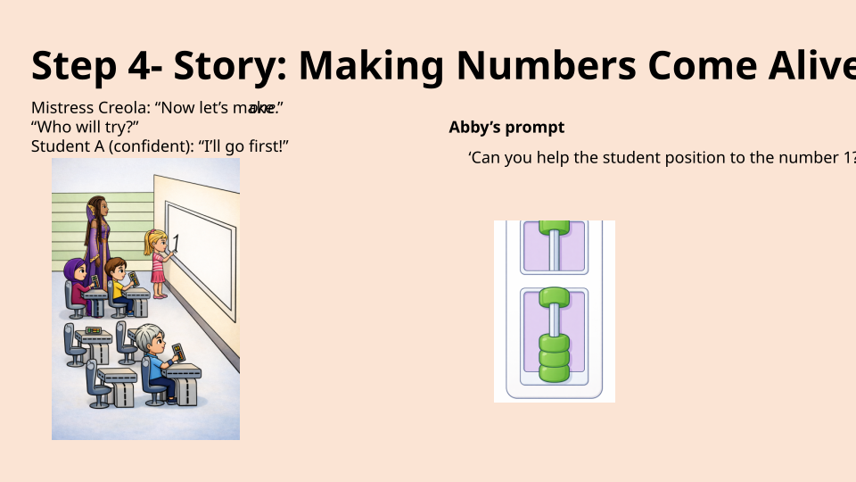

### Content
- Step 4- Story: Making Numbers Come Alive (1)
- Mistress Creola: “Now let’s make one.”“Who will try?” Student A (confident): “I’ll go first!”
- ‘Can you help the student position to the number 1?’”
- Abby’s prompt

---

## Scene 27
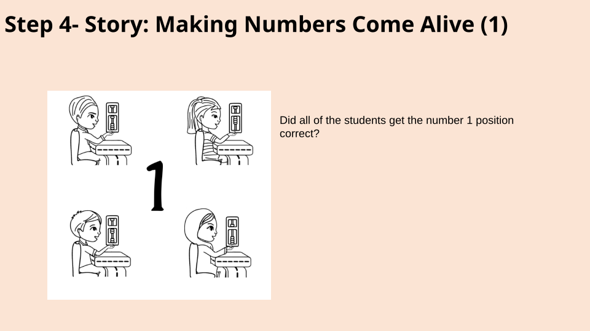

### Content
- Step 4- Story: Making Numbers Come Alive (1)
- Did all of the students get the number 1 position
correct?

### Narrator Script (Cousin's Voice)
> Nice work! I’m glad that they class has you to help them. You get one Quest Coin

---

## Scene 28
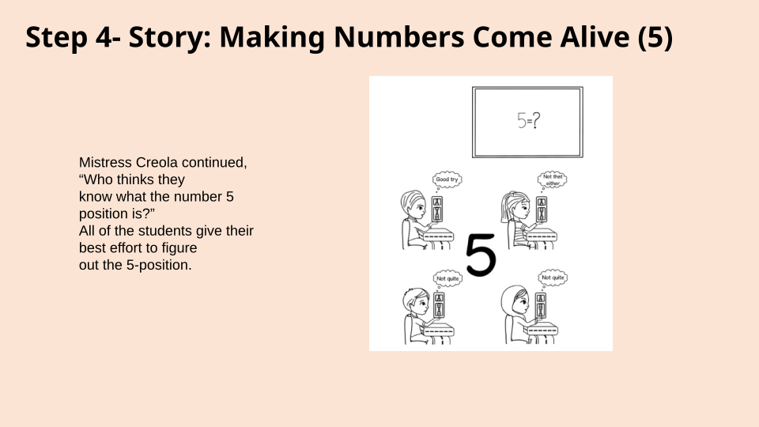

### Content
- Step 4- Story: Making Numbers Come Alive (5)
- Mistress Creola continued, “Who thinks they
know what the number 5 position is?”
All of the students give their best effort to figure
out the 5-position.

---

## Scene 29
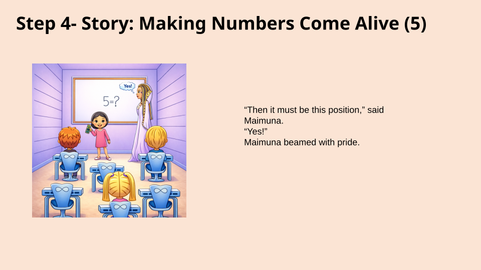

### Content
- Step 4- Story: Making Numbers Come Alive (5)
- “Then it must be this position,” said Maimuna.
“Yes!”
Maimuna beamed with pride.

---

## Scene 30
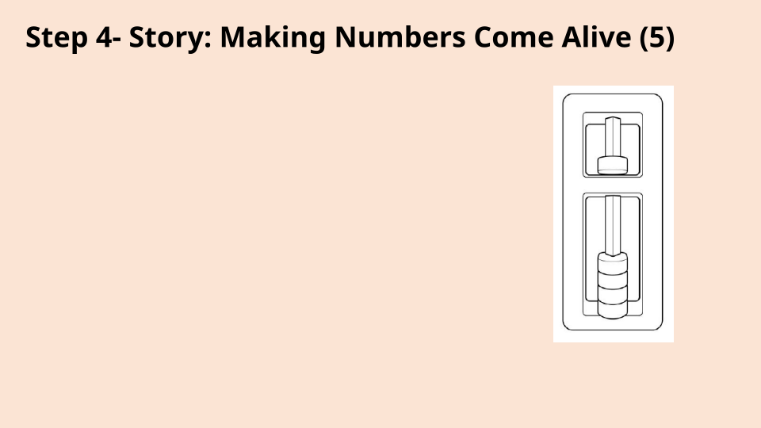

### Content
- Step 4- Story: Making Numbers Come Alive (5)

---

## Scene 31
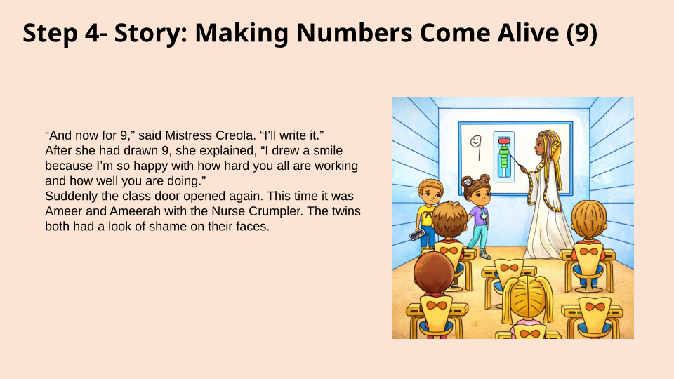

### Content
- Step 4- Story: Making Numbers Come Alive (9)
- “And now for 9,” said Mistress Creola. “I’ll write it.”
After she had drawn 9, she explained, “I drew a smile
because I’m so happy with how hard you all are working
and how well you are doing.”
Suddenly the class door opened again. This time it was
Ameer and Ameerah with the Nurse Crumpler. The twins
both had a look of shame on their faces.

---

## Scene 32
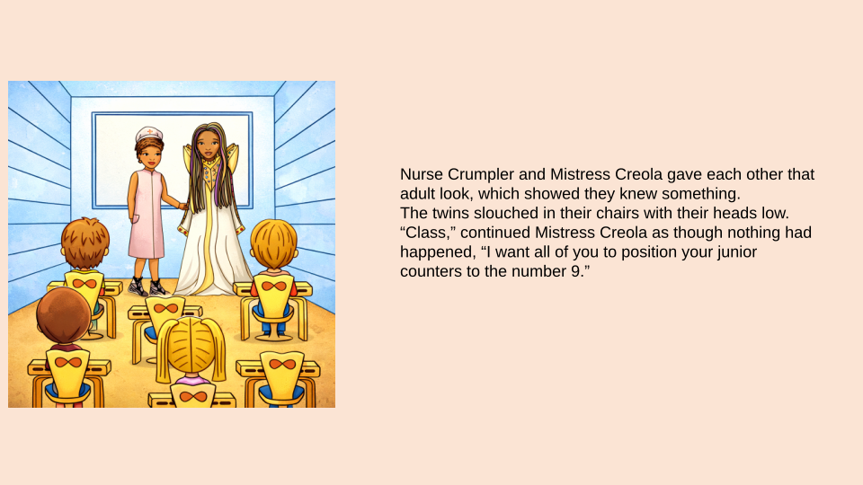

### Content
- Nurse Crumpler and Mistress Creola gave each other that
adult look, which showed they knew something.
The twins slouched in their chairs with their heads low.
“Class,” continued Mistress Creola as though nothing had
happened, “I want all of you to position your junior
counters to the number 9.”

---

## Scene 33
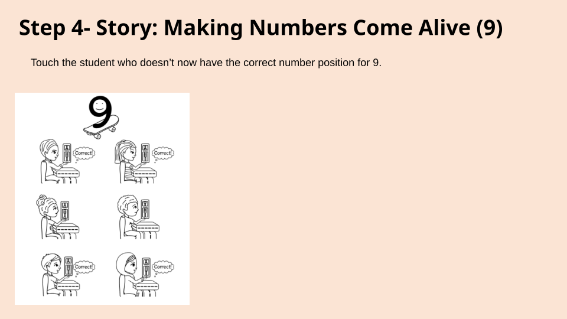

### Content
- Step 4- Story: Making Numbers Come Alive (9)
- Touch the student who doesn’t now have the correct number position for 9.

### Narrator Script (Cousin's Voice)
> Correct! You get one Quest coin!

---

## Scene 34
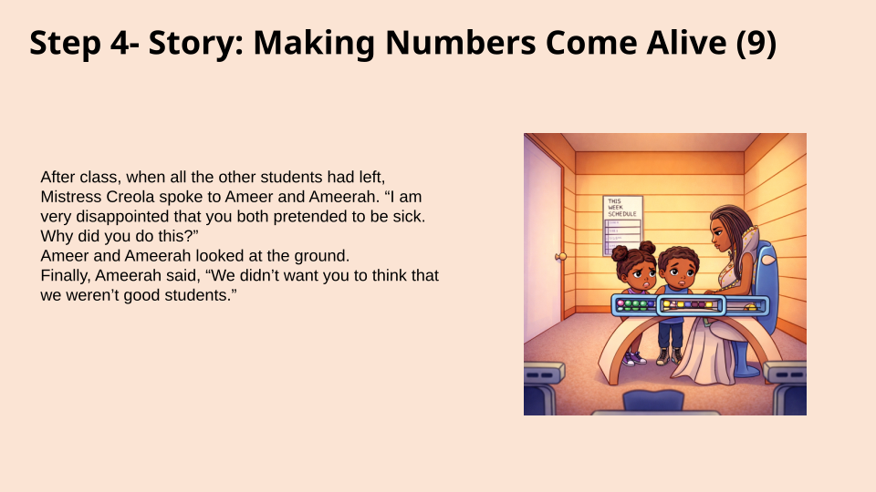

### Content
- Step 4- Story: Making Numbers Come Alive (9)
- After class, when all the other students had left,
Mistress Creola spoke to Ameer and Ameerah. “I am
very disappointed that you both pretended to be sick.
Why did you do this?”
Ameer and Ameerah looked at the ground.
Finally, Ameerah said, “We didn’t want you to think that
we weren’t good students.”

---

## Scene 35
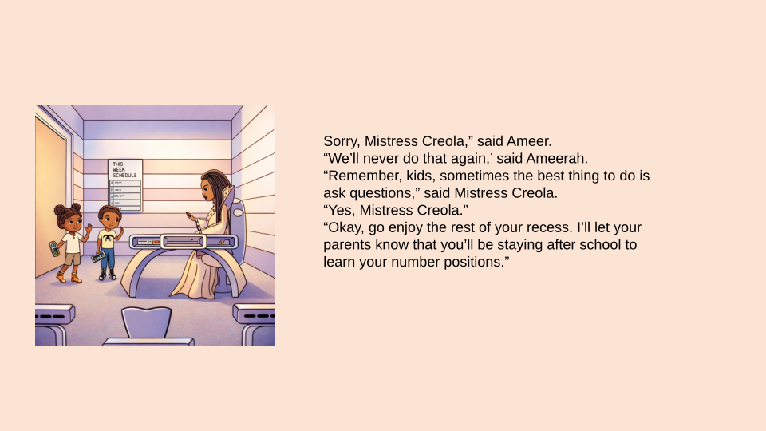

### Content
- Sorry, Mistress Creola,” said Ameer.
“We’ll never do that again,’ said Ameerah.
“Remember, kids, sometimes the best thing to do is
ask questions,” said Mistress Creola.
“Yes, Mistress Creola.”
“Okay, go enjoy the rest of your recess. I’ll let your
parents know that you’ll be staying after school to
learn your number positions.”

---

## Scene 36
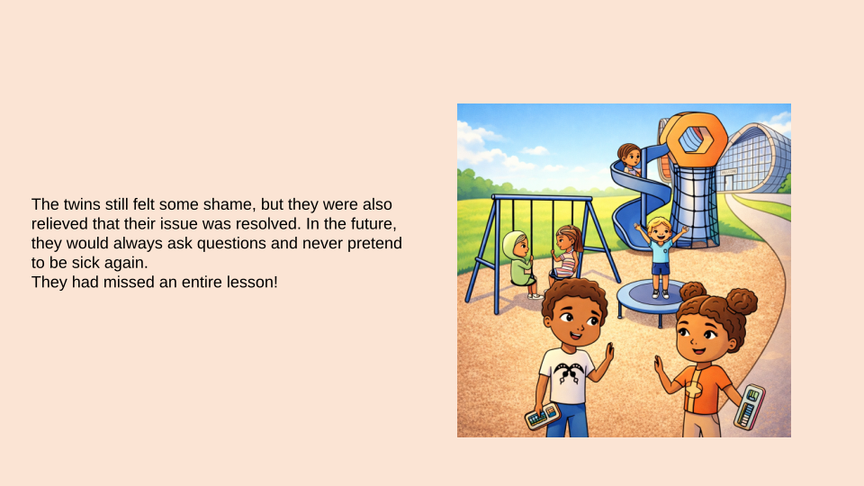

### Content
- The twins still felt some shame, but they were also
relieved that their issue was resolved. In the future,
they would always ask questions and never pretend
to be sick again.
They had missed an entire lesson!

---

## Scene 37
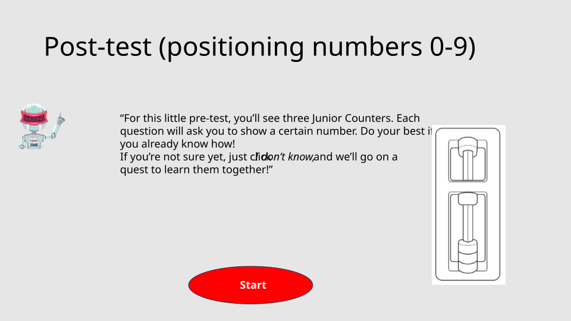

### Content
- Post-test (positioning numbers 0-9)
- “For this little pre-test, you’ll see three Junior Counters. Each question will ask you to show a certain number. Do your best if you already know how!
If you’re not sure yet, just click I don’t know, and we’ll go on a quest to learn them together!”

- Start

---

## Scene 38
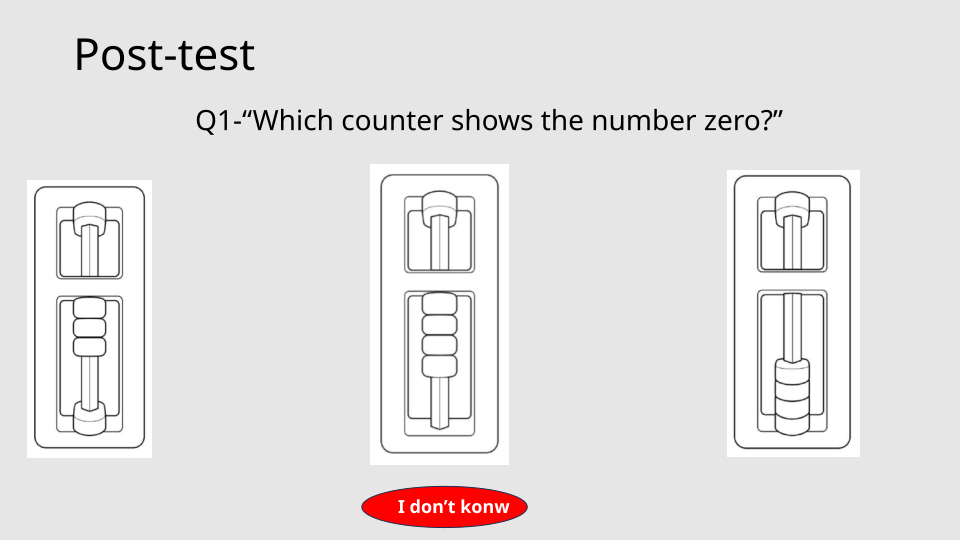

### Content
- Post-test
- Q1-“Which counter shows the number zero?”
- I don’t konw

---

## Scene 39

### Content
- Post-test
- Q2- “Which counter shows the number one?”
- I don’t konw

---

## Scene 40
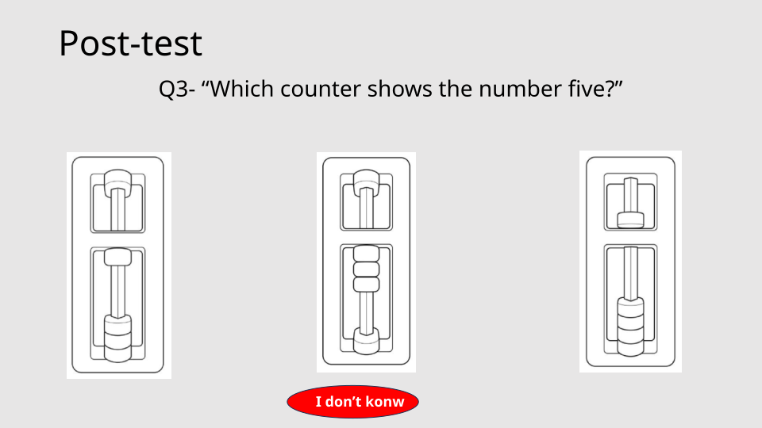

### Content
- Post-test
- Q3- “Which counter shows the number five?”
- I don’t konw

---

## Scene 41
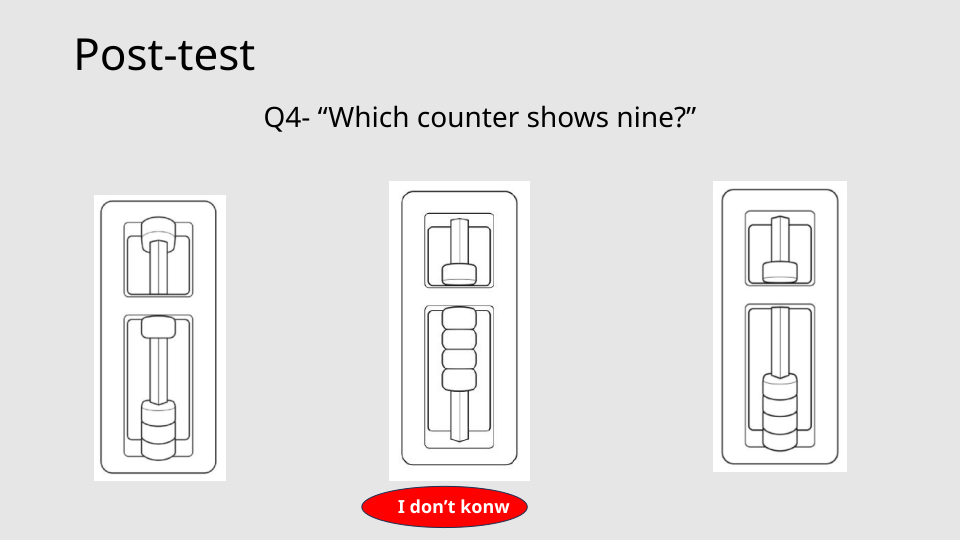

### Content
- Post-test
- Q4- “Which counter shows nine?”
- I don’t konw

---

## Scene 42
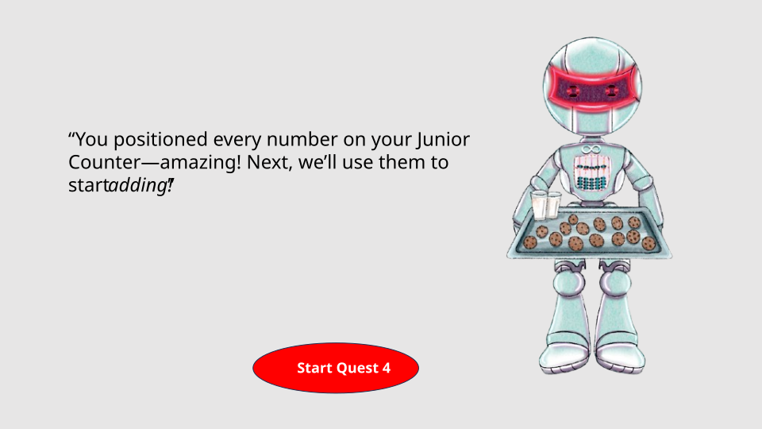

### Content
- “You positioned every number on your Junior Counter—amazing! Next, we’ll use them to start adding!”
- Start Quest 4

---

