# Storyboard Specification: AbaQuest-4 Freeze + Addition (updated images).pptx

## Scene 1

### Content

---

## Scene 2

### Content
- AbaQuest-4
- Freeze + Addition

---

## Scene 3
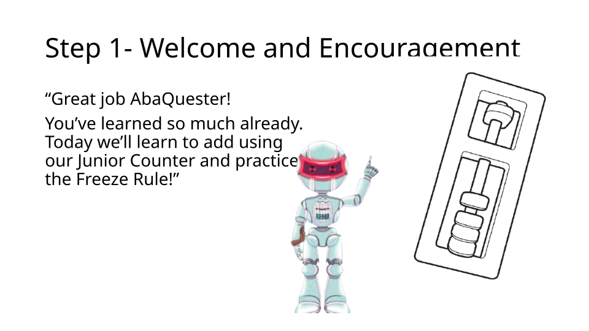

### Content
- Step 1- Welcome and Encouragement
- “Great job AbaQuester! 
You’ve learned so much already. Today we’ll learn to add using our Junior Counter and practice the Freeze Rule!”

### Narrator Script (Cousin's Voice)
> Tap Abby → confetti / sparkle.Button: “Let’s Start Adding!”

---

## Scene 4

### Content
- Pre-test

---

## Scene 5
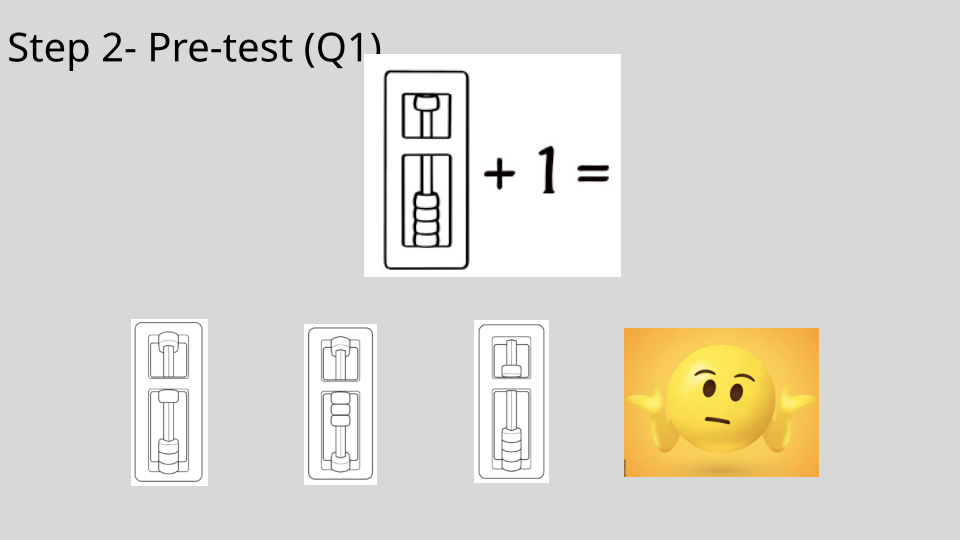

### Content
- Step 2- Pre-test (Q1)

---

## Scene 6
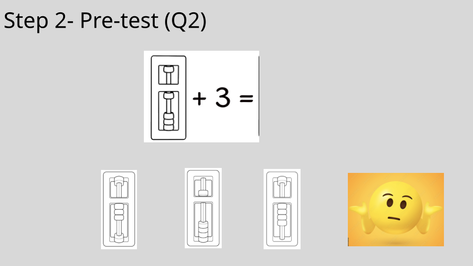

### Content
- Step 2- Pre-test (Q2)

---

## Scene 7
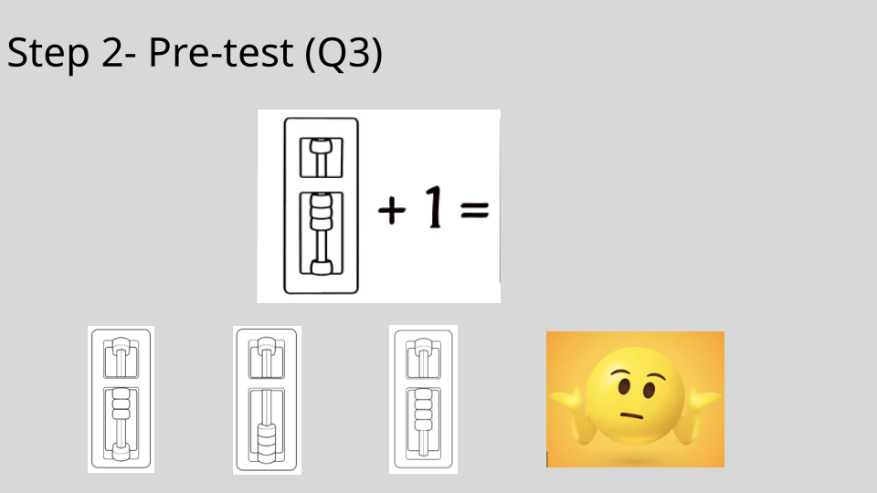

### Content
- Step 2- Pre-test (Q3)

---

## Scene 8
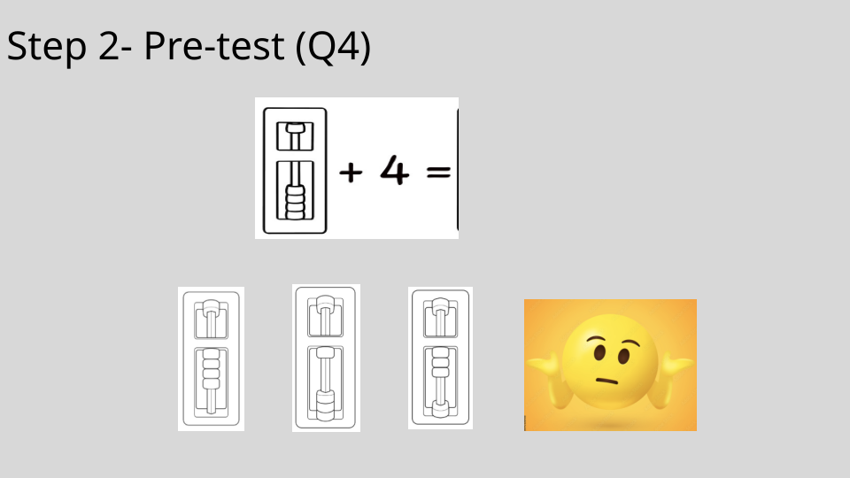

### Content
- Step 2- Pre-test (Q4)

---

## Scene 9
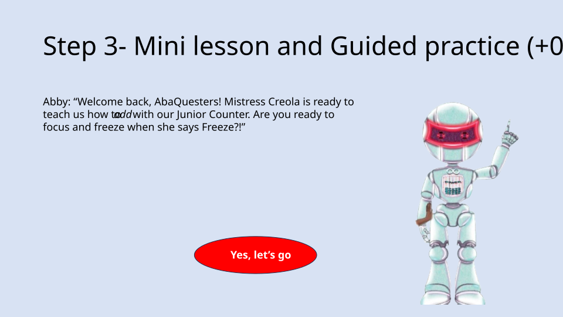

### Content
- Step 3- Mini lesson and Guided practice (+0)
- Abby: “Welcome back, AbaQuesters! Mistress Creola is ready to teach us how to add with our Junior Counter. Are you ready to focus and freeze when she says Freeze?!”
- Yes, let’s go

---

## Scene 10
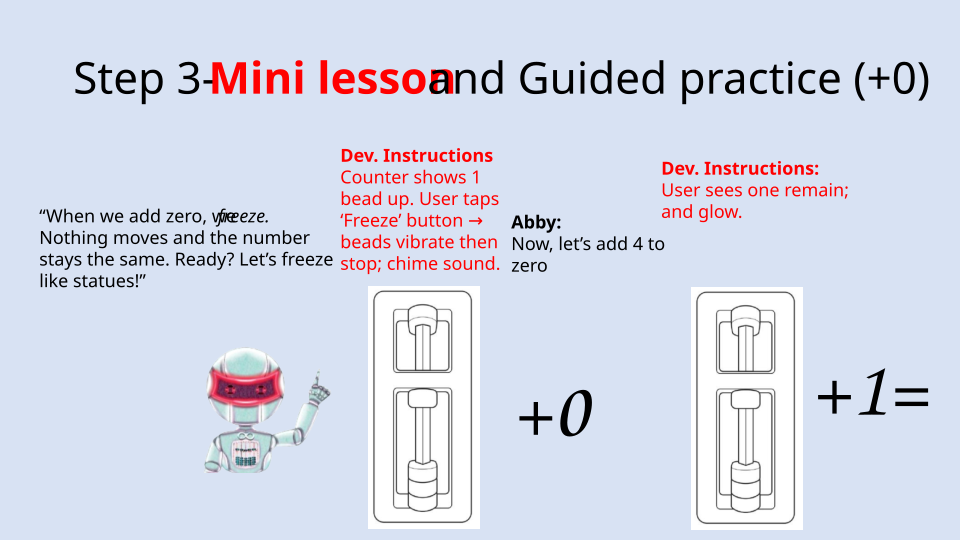

### Content
- Step 3- Mini lesson and Guided practice (+0)
- “When we add zero, we freeze. Nothing moves and the number stays the same. Ready? Let’s freeze like statues!”
- Dev. Instructions
Counter shows 1 bead up. User taps ‘Freeze’ button → beads vibrate then stop; chime sound.
- +0
- Abby:
Now, let’s add 4 to zero
- Dev. Instructions:
User sees one remain; and glow.
- +1=

---

## Scene 11
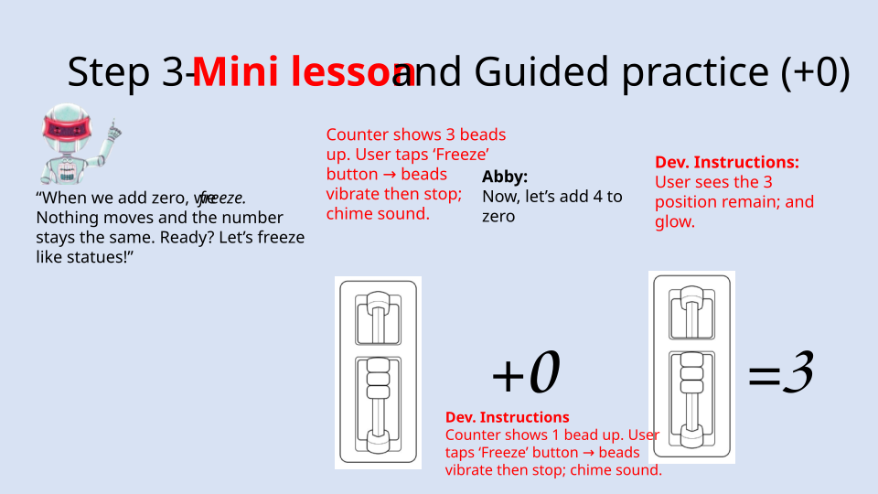

### Content
- Step 3- Mini lesson and Guided practice (+0)
- “When we add zero, we freeze. Nothing moves and the number stays the same. Ready? Let’s freeze like statues!”
- Counter shows 3 beads up. User taps ‘Freeze’ button → beads vibrate then stop; chime sound.
- +0
- Abby:
Now, let’s add 4 to zero
- Dev. Instructions:
User sees the 3 position remain; and glow.
- =3
- Dev. Instructions
Counter shows 1 bead up. User taps ‘Freeze’ button → beads vibrate then stop; chime sound.

### Narrator Script (Cousin's Voice)
> Great job adding A, AbaQuesters!!!
Amazing!!
If you got this down, adding the rest of the numbers from 1 to INFINITY will be EASY!!

---

## Scene 12
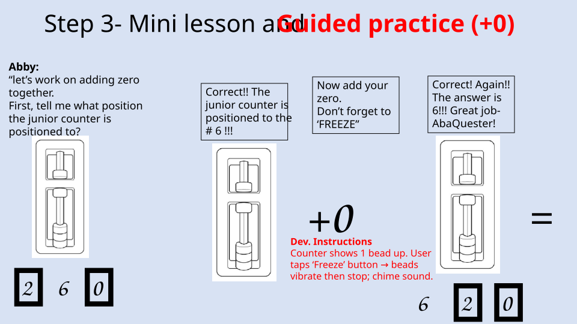

### Content
- Step 3- Mini lesson and Guided practice (+0)
- Abby:
“let’s work on adding zero together.
First, tell me what position the junior counter is positioned to?

- Correct!! The junior counter is positioned to the # 6 !!!
- +0
- 2
- 0
- 6
- Now add your zero.
Don’t forget to ‘FREEZE”
- 0
- 2
- 6
- =
- Correct! Again!! The answer is 6!!! Great job- AbaQuester!
- Dev. Instructions
Counter shows 1 bead up. User taps ‘Freeze’ button → beads vibrate then stop; chime sound.

### Narrator Script (Cousin's Voice)
> Not, quite, try again.
Close, look at. Both the upper and lower beads.
Here’s the correct answer….

---

## Scene 13
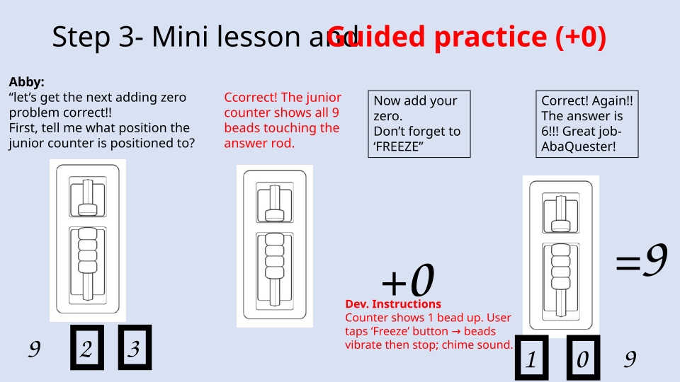

### Content
- Step 3- Mini lesson and Guided practice (+0)
- Abby:
“let’s get the next adding zero problem correct!!
First, tell me what position the junior counter is positioned to?
- Ccorrect! The junior counter shows all 9 beads touching the answer rod. 
- +0
- 3
- 2
- 9
- Now add your zero.
Don’t forget to ‘FREEZE”
- Dev. Instructions
Counter shows 1 bead up. User taps ‘Freeze’ button → beads vibrate then stop; chime sound.
- =9
- 9
- 0
- 1
- Correct! Again!! The answer is 6!!! Great job- AbaQuester!

---

## Scene 14
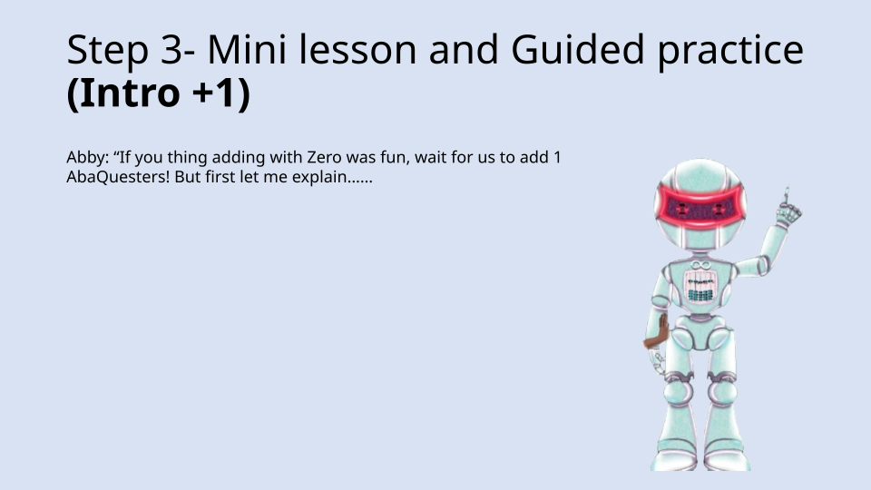

### Content
- Step 3- Mini lesson and Guided practice (Intro +1)
- Abby: “If you thing adding with Zero was fun, wait for us to add 1 AbaQuesters! But first let me explain……

---

## Scene 15

### Content
- Celebration
- Abby: “If you thing adding with Zero was fun, wait for us to add 1 AbaQuesters! But first let me explain……

---

## Scene 16
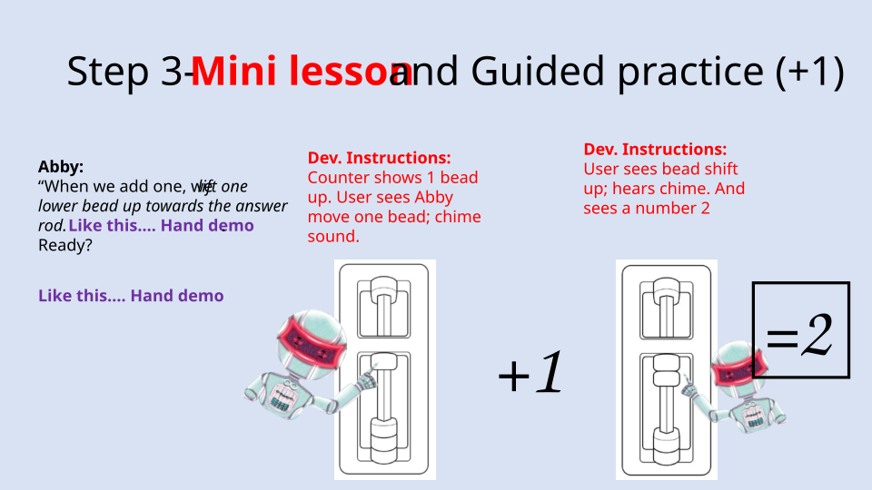

### Content
- Step 3- Mini lesson and Guided practice (+1)
- Abby:
“When we add one, we lift one lower bead up towards the answer rod. Like this…. Hand demo. Ready? 
- Dev. Instructions:
Counter shows 1 bead up. User sees Abby move one bead; chime sound.
- +1
- Like this…. Hand demo
- Dev. Instructions:
User sees bead shift up; hears chime. And sees a number 2 
- =2

---

## Scene 17
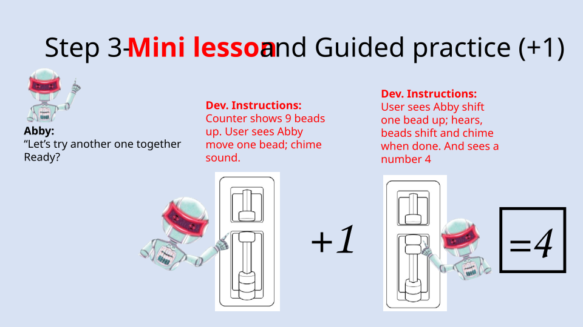

### Content
- Step 3- Mini lesson and Guided practice (+1)
- Abby:
“Let’s try another one together Ready? 
- +1
- Dev. Instructions:
Counter shows 9 beads up. User sees Abby move one bead; chime sound.
- =4
- Dev. Instructions:
User sees Abby shift one bead up; hears, beads shift and chime when done. And sees a number 4 

---

## Scene 18
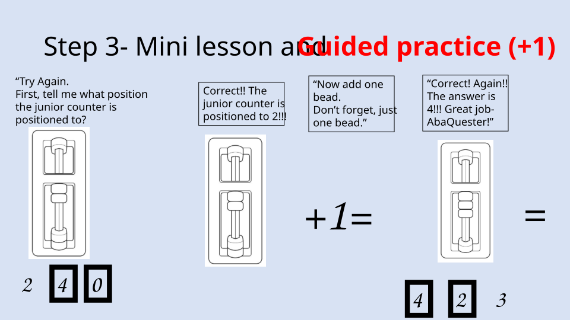

### Content
- Step 3- Mini lesson and Guided practice (+1)
- “Try Again.
First, tell me what position the junior counter is positioned to?

- Correct!! The junior counter is positioned to 2!!!
- +1=
- 2
- 0
- 4
- “Now add one bead.
Don’t forget, just one bead.”
- 3
- 2
- 4
- =
- “Correct! Again!! The answer is 4!!! Great job- AbaQuester!”

### Narrator Script (Cousin's Voice)
> Not, quite, try again.
Close, look at. Both the upper and lower beads.
Here’s the correct answer….

---

## Scene 19
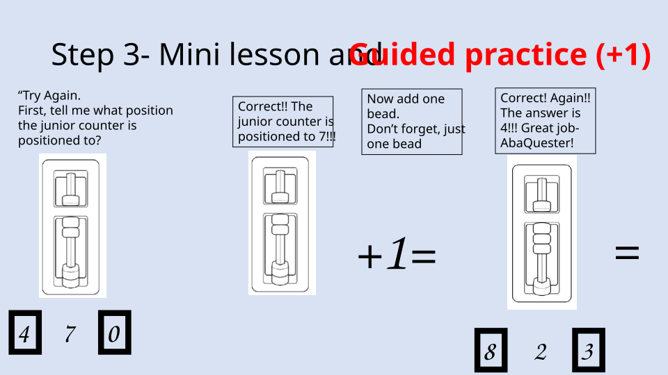

### Content
- Step 3- Mini lesson and Guided practice (+1)
- “Try Again.
First, tell me what position the junior counter is positioned to?

- Correct!! The junior counter is positioned to 7!!!
- +1=
- 7
- 0
- 4
- Now add one bead.
Don’t forget, just one bead
- 3
- 2
- 8
- =
- Correct! Again!! The answer is 4!!! Great job- AbaQuester!

### Narrator Script (Cousin's Voice)
> Not, quite, try again.
Close, look at. Both the upper and lower beads.
Here’s the correct answer….

---

## Scene 20
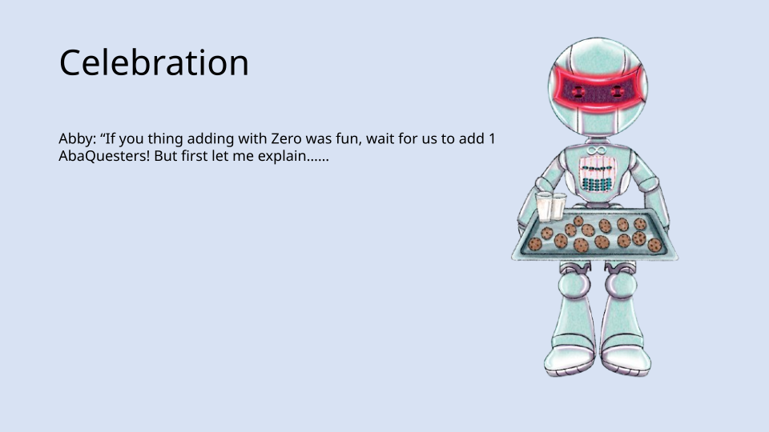

### Content
- Celebration
- Abby: “If you thing adding with Zero was fun, wait for us to add 1 AbaQuesters! But first let me explain……

---

## Scene 21
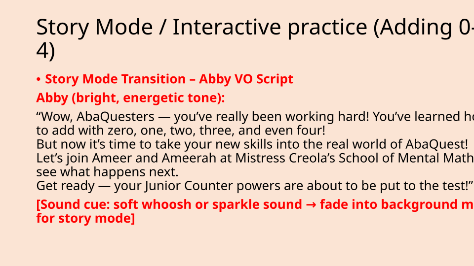

### Content
- Story Mode / Interactive practice (Adding 0-4)
- Story Mode Transition – Abby VO Script
Abby (bright, energetic tone):
“Wow, AbaQuesters — you’ve really been working hard! You’ve learned how to add with zero, one, two, three, and even four!But now it’s time to take your new skills into the real world of AbaQuest!Let’s join Ameer and Ameerah at Mistress Creola’s School of Mental Math to see what happens next.Get ready — your Junior Counter powers are about to be put to the test!”
[Sound cue: soft whoosh or sparkle sound → fade into background music for story mode]

### Narrator Script (Cousin's Voice)
> Developer Notes
Use a soft fade-out from the last practice screen.
Add sparkle or swirl animation around the screen as Abby says “real world of AbaQuest.”
Transition into the story scene (boat, classroom, or freeze sequence) with a gentle camera zoom or slide-in.
Optional: flash the text on-screen —

---

## Scene 22
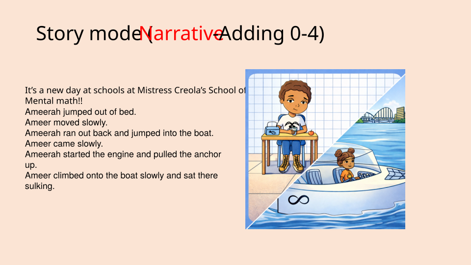

### Content
- Story mode (Narrative-Adding 0-4)
- It’s a new day at schools at Mistress Creola’s School of Mental math!!
Ameerah jumped out of bed.
Ameer moved slowly.
Ameerah ran out back and jumped into the boat.
Ameer came slowly.
Ameerah started the engine and pulled the anchor up.
Ameer climbed onto the boat slowly and sat there sulking.

---

## Scene 23
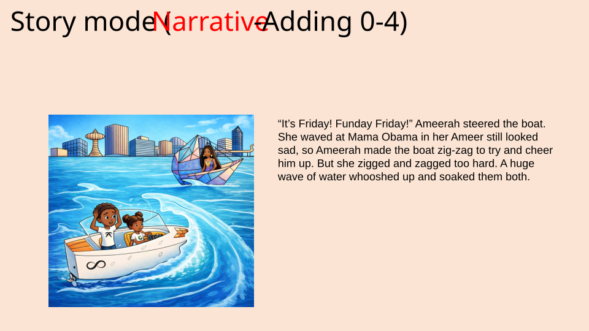

### Content
- “It’s Friday! Funday Friday!” Ameerah steered the boat. She waved at Mama Obama in her Ameer still looked sad, so Ameerah made the boat zig-zag to try and cheer him up. But she zigged and zagged too hard. A huge wave of water whooshed up and soaked them both.

- Story mode (Narrative-Adding 0-4)

---

## Scene 24
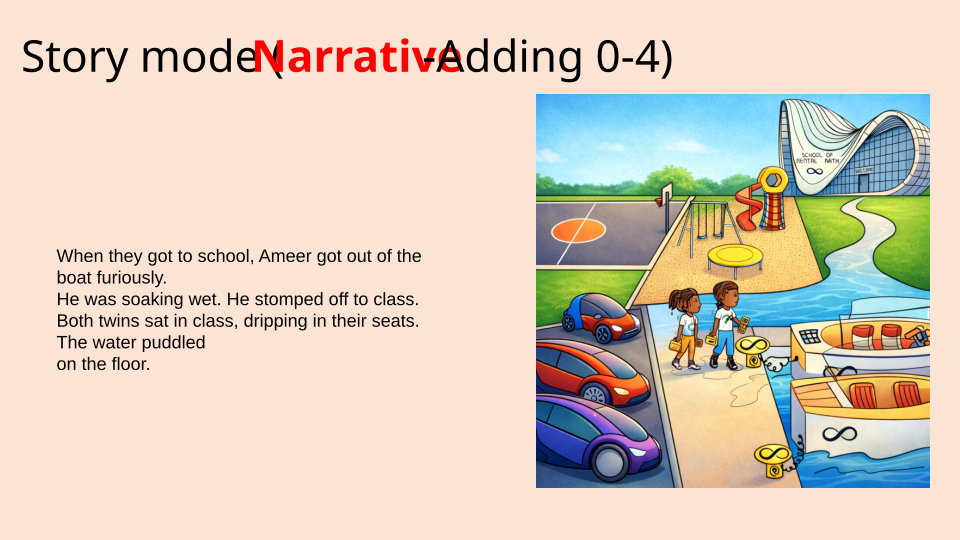

### Content
- When they got to school, Ameer got out of the boat furiously.
He was soaking wet. He stomped off to class.
Both twins sat in class, dripping in their seats. The water puddled
on the floor.

- Story mode (Narrative-Adding 0-4)

---

## Scene 25
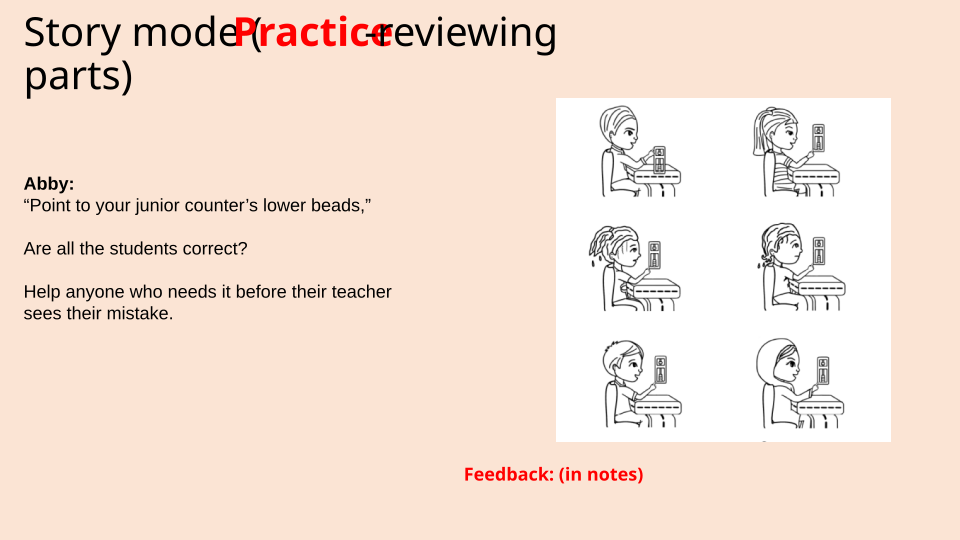

### Content
- Abby:
“Point to your junior counter’s lower beads,”

Are all the students correct?

Help anyone who needs it before their teacher sees their mistake.
- Story mode (Practice-reviewing parts)
- Feedback: (in notes)

### Narrator Script (Cousin's Voice)
> Correct Feedback:
“Nice work! That student is pointing to the lower beads.”- you get a Quest Coin!

Incorrect Feedback:
Hint: “Almost. The lower beads are at the bottom.”
Who’s pointing to the beads below the answer rod?”
“Try the student using the bottom beads.”

4. After 3 incorrect attempts: ighlight the correct student with a pulsing outline.
Play Abby:
“Here’s the one using the lower beads. Tap this student.”
Keep interaction active — user must still tap to confirm (teaches agency)

---

## Scene 26
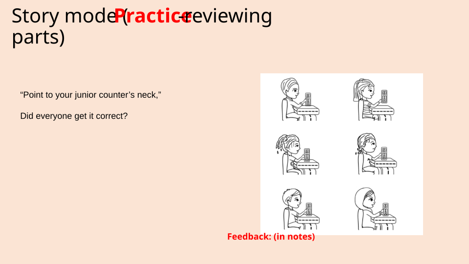

### Content
- “Point to your junior counter’s neck,” 

Did everyone get it correct?
- Feedback: (in notes)
- Story mode (Practice-reviewing parts)

### Narrator Script (Cousin's Voice)
> Correct Feedback:
“Nice work! That student is pointing to the lower beads.”- you get a Quest Coin!

Incorrect Feedback:
Hint: “Almost. The lower beads are at the bottom.”
Who’s pointing to the beads below the answer rod?”
“Try the student using the bottom beads.”

4. After 3 incorrect attempts: ighlight the correct student with a pulsing outline.
Play Abby:
“Here’s the one using the lower beads. Tap this student.”
Keep interaction active — user must still tap to confirm (teaches agency)

---

## Scene 27
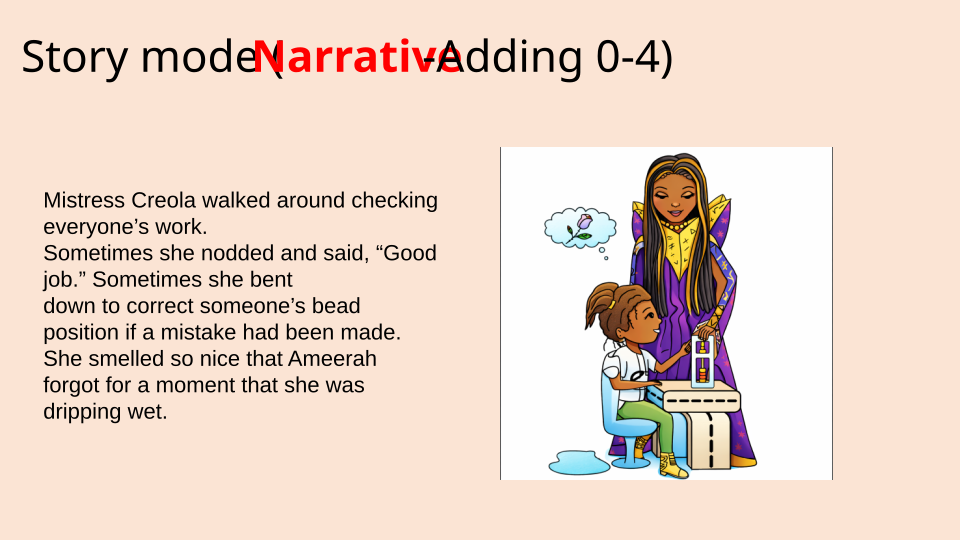

### Content
- Mistress Creola walked around checking everyone’s work.
Sometimes she nodded and said, “Good job.” Sometimes she bent
down to correct someone’s bead position if a mistake had been made.
She smelled so nice that Ameerah forgot for a moment that she was dripping wet.

- Story mode (Narrative-Adding 0-4)

---

## Scene 28
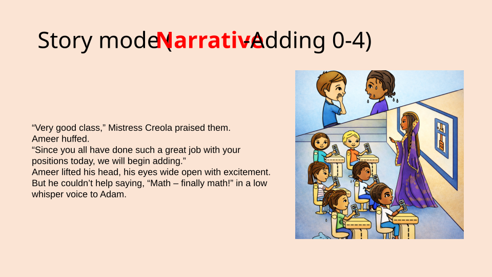

### Content
- Story mode (Narrative-Adding 0-4)
- “Very good class,” Mistress Creola praised them.
Ameer huffed.
“Since you all have done such a great job with your positions today, we will begin adding.”
Ameer lifted his head, his eyes wide open with excitement.
But he couldn’t help saying, “Math – finally math!” in a low
whisper voice to Adam.

---

## Scene 29
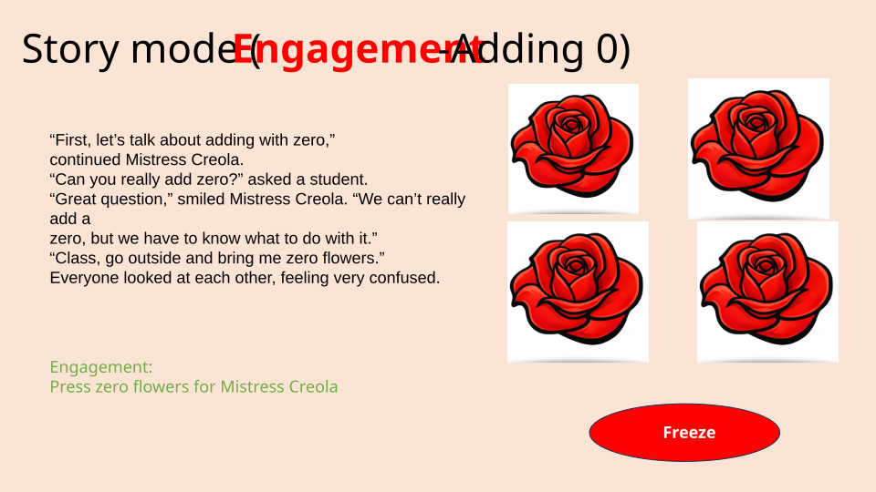

### Content
- “First, let’s talk about adding with zero,”
continued Mistress Creola.
“Can you really add zero?” asked a student.
“Great question,” smiled Mistress Creola. “We can’t really add a
zero, but we have to know what to do with it.”
“Class, go outside and bring me zero flowers.”
Everyone looked at each other, feeling very confused.

- Story mode (Engagement-Adding 0)
- Engagement:
Press zero flowers for Mistress Creola
- Freeze

---

## Scene 30
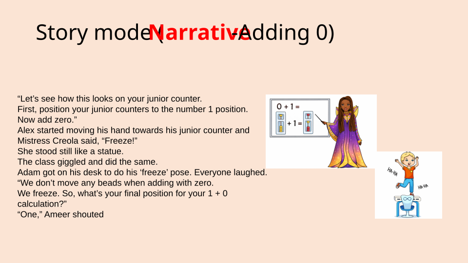

### Content
- Story mode (Narrative-Adding 0)
- “Let’s see how this looks on your junior counter.
First, position your junior counters to the number 1 position.
Now add zero.”
Alex started moving his hand towards his junior counter and
Mistress Creola said, “Freeze!”
She stood still like a statue.
The class giggled and did the same.
Adam got on his desk to do his ‘freeze’ pose. Everyone laughed.
“We don’t move any beads when adding with zero.
We freeze. So, what’s your final position for your 1 + 0
calculation?”
“One,” Ameer shouted

---

## Scene 31
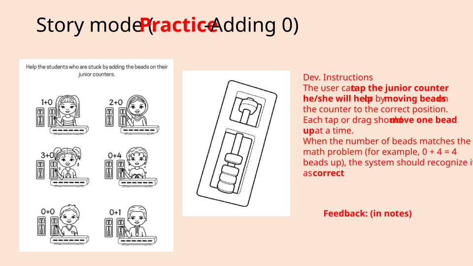

### Content
- Story mode (Practice-Adding 0)
- Dev. Instructions
The user can tap the junior counter he/she will help or by moving beads on the counter to the correct position.
Each tap or drag should move one bead up at a time.
When the number of beads matches the math problem (for example, 0 + 4 = 4 beads up), the system should recognize it as correct.
- Feedback: (in notes)

### Narrator Script (Cousin's Voice)
> What happens when they get it right
When the user fixes a student’s counter correctly:
Play a happy chime sound
Show a green check mark or a sparkle on that student
Play Abby’s voice:
“Yes! That’s right — one plus zero is one!”or“Nice helping! That student has the right amount now.”
Give the user 1 Quest Coin
Lock that student’s counter so it can’t be changed
When all 6 students are correct, play a group celebration:
“You helped everyone! Great teamwork!”

What happens if they make a mistake
If the user adds too many beads or not enough:
Play a soft, gentle error sound (not a buzzer)
Shake or wiggle the counter slightly to show it’s wrong
Have Abby say something encouraging, like:
“Hmm, that’s a little too many. Try again.”
“You don’t need that many beads.”
“Check the number in the problem — it’s zero plus four.”
If they try three times and still can’t get it:
Gently highlight the correct counter position
Abby says:
“Here’s what it should look like — four beads for zero plus four!”

---

## Scene 32
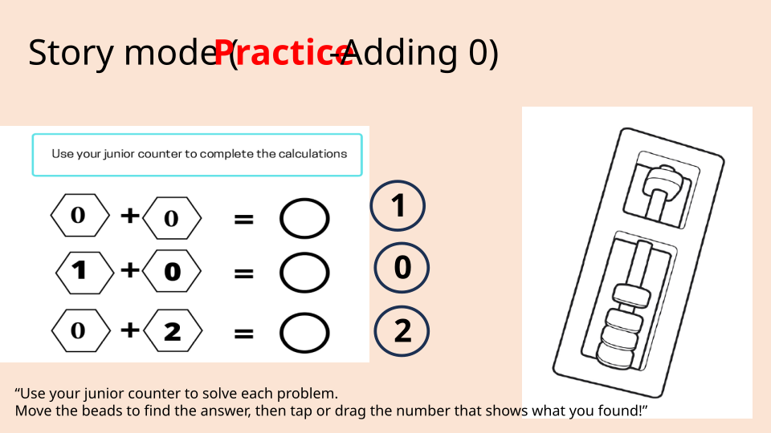

### Content
- Story mode (Practice-Adding 0)
- 1
- 0
- 2
- “Use your junior counter to solve each problem. 
Move the beads to find the answer, then tap or drag the number that shows what you found!”

### Narrator Script (Cousin's Voice)
> Developer Flow
1. When the screen loads
Play Abby’s instruction VO above.
Junior counter starts empty (no beads up).
User can move beads up or down freely.
User must pick or drag the correct answer to each problem’s blank circle.

2. When the user selects the correct answer
(For example, choosing “0” for 0+0 or “2” for 0+2)
Actions:
Play a soft “✨chime” sound (SFX_SUCCESS_CHIME).
Highlight the correct circle with a soft green glow.
Show a quick sparkle or “pop” animation.
Lock that question so it can’t be changed.
Reward: add 1 Quest Coin to the counter (optional).
Abby VO options (rotate randomly):
“Nice work! That’s right — zero plus zero is zero.”
“Good job! You got it — one plus zero is one.”
“Great thinking! Zero plus two makes two.”
“Perfect! You’re using your counter like a real mathematician.”

3. When the user picks the wrong answer
Actions:
Play a gentle “oops” sound (SFX_SOFT_ERROR).
Shake or wiggle the wrong circle briefly.
Keep the question active (don’t lock it yet).
Show a light red outline that fades away in 1–2 seconds.
Abby VO options (rotate randomly):
“Hmm, not quite. Try using your counter to check again.”
“Let’s count your beads — does that match your answer?”
“Almost! Move your beads and see what number you get.”

Hints (optional after 2 incorrect tries)
If the user misses the same problem twice:
Highlight the correct number with a soft pulsing glow.
Play Abby VO hint:
“Here’s a tip — move your beads to match the problem. Zero plus two means, freeze the beads to position to zero and move two beads up!”

---

## Scene 33
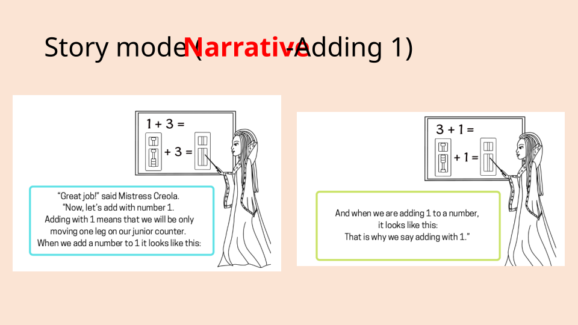

### Content
- Story mode (Narrative-Adding 1)

---

## Scene 34
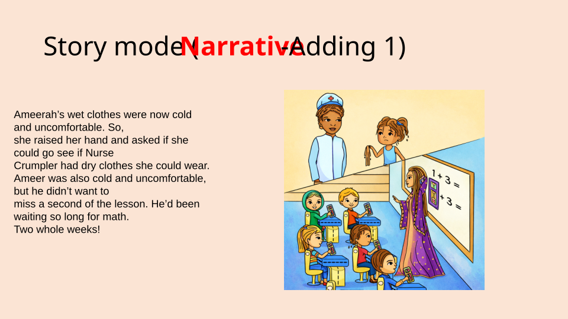

### Content
- Story mode (Narrative-Adding 1)
- Ameerah’s wet clothes were now cold and uncomfortable. So,
she raised her hand and asked if she could go see if Nurse
Crumpler had dry clothes she could wear.
Ameer was also cold and uncomfortable, but he didn’t want to
miss a second of the lesson. He’d been waiting so long for math.
Two whole weeks!

---

## Scene 35
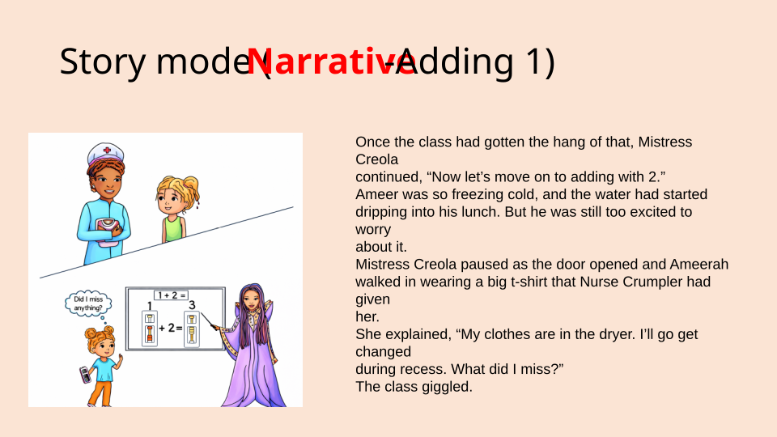

### Content
- Story mode (Narrative-Adding 1)
- Once the class had gotten the hang of that, Mistress Creola
continued, “Now let’s move on to adding with 2.”
Ameer was so freezing cold, and the water had started
dripping into his lunch. But he was still too excited to worry
about it.
Mistress Creola paused as the door opened and Ameerah
walked in wearing a big t-shirt that Nurse Crumpler had given
her.
She explained, “My clothes are in the dryer. I’ll go get changed
during recess. What did I miss?”
The class giggled.

---

## Scene 36
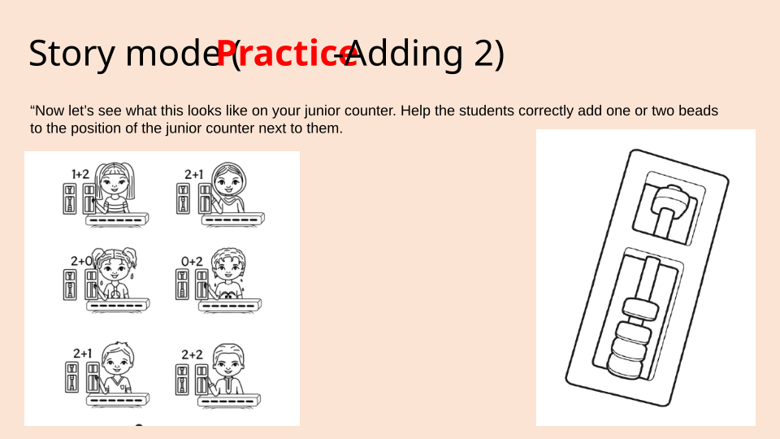

### Content
- “Now let’s see what this looks like on your junior counter. Help the students correctly add one or two beads to the position of the junior counter next to them.
- Story mode (Practice-Adding 2)

### Narrator Script (Cousin's Voice)
> Developer Flow
1. On Screen Load
Play Abby’s instruction VO above.
Show all six students, each with a visible junior counter and math problem above their heads.
The counters should show only the first number of each problem (for example, for 1+2, start with 1 bead up).
All problems are interactive — students can be solved in any order.

User Interaction
The user moves beads upward on each counter to show the total.
Each counter listens for the correct number of beads (the sum).

When the user gets it right- by placing the correct bead positioning
Actions:
Play success sound → SFX_SUCCESS_CHIME.
Highlight the correct counter with a soft green glow.
Show a quick sparkle or pop animation on that student.
Lock that counter (no more movement).
Reward: +1 Quest Coin.
Play Abby’s positive feedback VO.
Abby VO options (rotate randomly):
“Yes! One plus two makes three — nice work!”
“That’s right! Two plus one also makes three.”
“You got it! Zero plus two equals two.”
“Excellent! Two plus two is four — you’re getting good at this!”

❌ When the user moves beads incorrectly
Actions:
Play gentle “oops” sound → SFX_SOFT_ERROR.
Counter shakes slightly (0.3s).
Fade in/out a red outline around the counter (no harsh flash).
Keep the counter unlocked so they can fix it.
Abby VO options:
“Hmm, that doesn’t look right. Try counting again.”
“Check your counter — does it match the problem?”
“Almost there! Move one more bead and see what happens.”

Hint Behavior (optional after 2 wrong tries)
If the learner gets it wrong twice:
Highlight the correct number of beads with a glowing guide animation.
Play Abby’s hint VO:
“Try counting all the beads together — one, two, three. That’s the answer!”

🎉 When all problems are correct
Actions:
Play celebration sound → SFX_CELEBRATION_SHORT.
Show sparkles around all six students.
Display +6 Quest Coins (if using reward system).
Play Abby’s closing VO.

---

## Scene 37
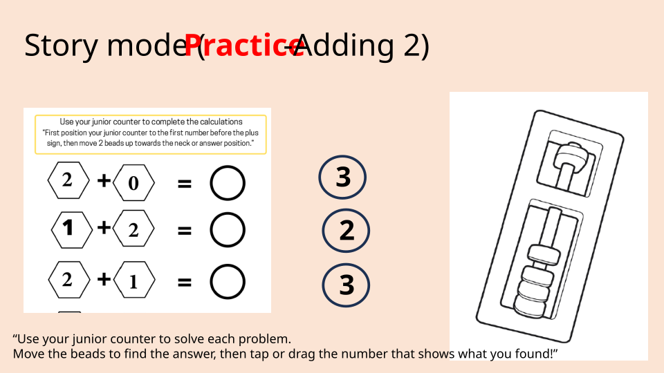

### Content
- Story mode (Practice-Adding 2)
- 3
- 2
- 3
- “Use your junior counter to solve each problem. 
Move the beads to find the answer, then tap or drag the number that shows what you found!”

### Narrator Script (Cousin's Voice)
> Developer Flow
1. When the screen loads
Play Abby’s instruction VO above.
Junior counter starts empty (no beads up).
User can move beads up or down freely.
User must pick or drag the correct answer to each problem’s blank circle.

2. When the user selects the correct answer
(For example, choosing “0” for 0+0 or “2” for 0+2)
Actions:
Play a soft “✨chime” sound (SFX_SUCCESS_CHIME).
Highlight the correct circle with a soft green glow.
Show a quick sparkle or “pop” animation.
Lock that question so it can’t be changed.
Reward: add 1 Quest Coin to the counter (optional).
Abby VO options (rotate randomly):
“Nice work! That’s right — zero plus zero is zero.”
“Good job! You got it — one plus zero is one.”
“Great thinking! Zero plus two makes two.”
“Perfect! You’re using your counter like a real mathematician.”

3. When the user picks the wrong answer
Actions:
Play a gentle “oops” sound (SFX_SOFT_ERROR).
Shake or wiggle the wrong circle briefly.
Keep the question active (don’t lock it yet).
Show a light red outline that fades away in 1–2 seconds.
Abby VO options (rotate randomly):
“Hmm, not quite. Try using your counter to check again.”
“Let’s count your beads — does that match your answer?”
“Almost! Move your beads and see what number you get.”

Hints (optional after 2 incorrect tries)
If the user misses the same problem twice:
Highlight the correct number with a soft pulsing glow.
Play Abby VO hint:
“Here’s a tip — move your beads to match the problem. Zero plus two means, freeze the beads to position to zero and move two beads up!”

---

## Scene 38
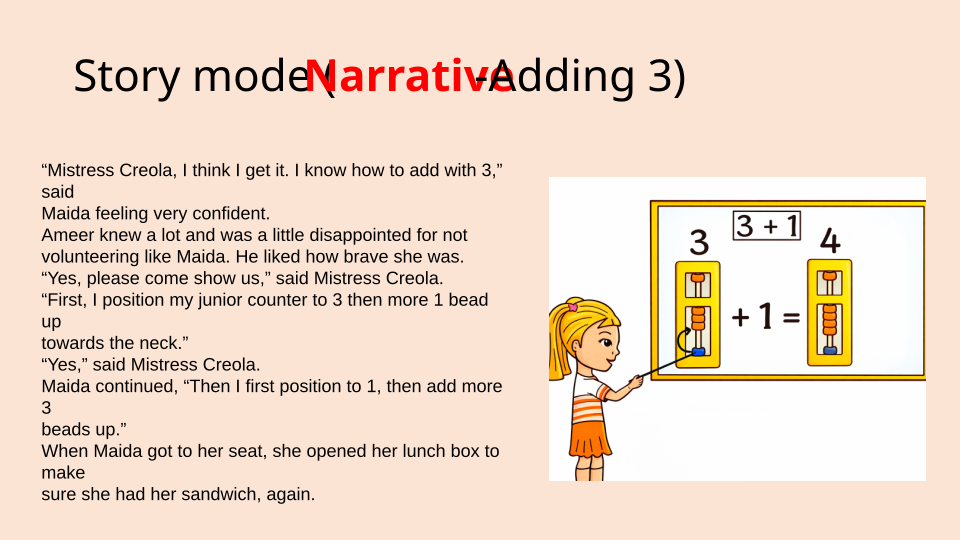

### Content
- “Mistress Creola, I think I get it. I know how to add with 3,” said
Maida feeling very confident.
Ameer knew a lot and was a little disappointed for not
volunteering like Maida. He liked how brave she was.
“Yes, please come show us,” said Mistress Creola.
“First, I position my junior counter to 3 then more 1 bead up
towards the neck.”
“Yes,” said Mistress Creola.
Maida continued, “Then I first position to 1, then add more 3
beads up.”
When Maida got to her seat, she opened her lunch box to make
sure she had her sandwich, again.
- Story mode (Narrative-Adding 3)

---

## Scene 39
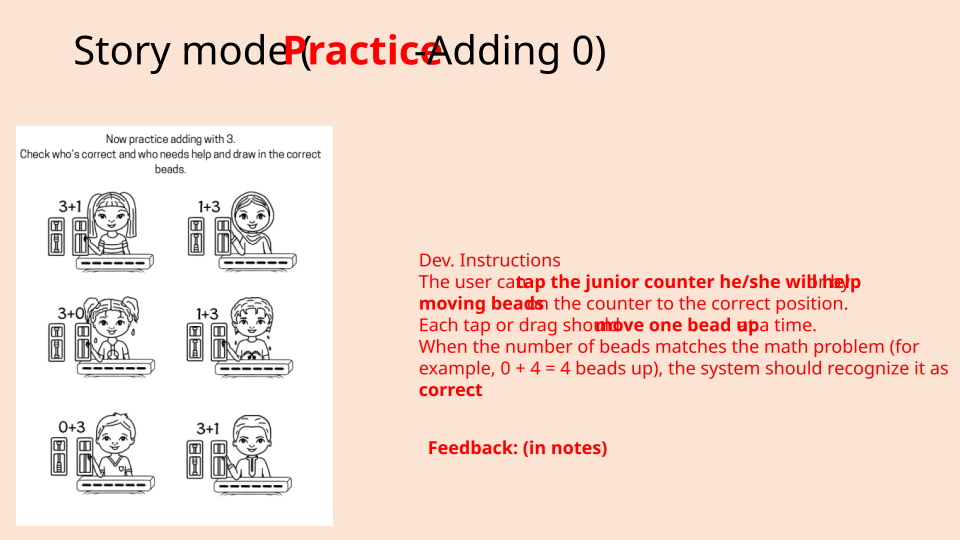

### Content
- Story mode (Practice-Adding 0)
- Dev. Instructions
The user can tap the junior counter he/she will help or by moving beads on the counter to the correct position.
Each tap or drag should move one bead up at a time.
When the number of beads matches the math problem (for example, 0 + 4 = 4 beads up), the system should recognize it as correct.
- Feedback: (in notes)

### Narrator Script (Cousin's Voice)
> What happens when they get it right
When the user fixes a student’s counter correctly:
Play a happy chime sound
Show a green check mark or a sparkle on that student
Play Abby’s voice:
“Yes! That’s right — one plus zero is one!”or“Nice helping! That student has the right amount now.”
Give the user 1 Quest Coin
Lock that student’s counter so it can’t be changed
When all 6 students are correct, play a group celebration:
“You helped everyone! Great teamwork!”

What happens if they make a mistake
If the user adds too many beads or not enough:
Play a soft, gentle error sound (not a buzzer)
Shake or wiggle the counter slightly to show it’s wrong
Have Abby say something encouraging, like:
“Hmm, that’s a little too many. Try again.”
“You don’t need that many beads.”
“Check the number in the problem — it’s zero plus four.”
If they try three times and still can’t get it:
Gently highlight the correct counter position
Abby says:
“Here’s what it should look like — four beads for zero plus four!”

---

## Scene 40
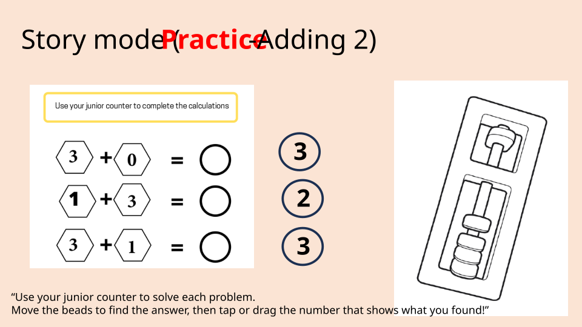

### Content
- Story mode (Practice-Adding 2)
- 3
- 2
- 3
- “Use your junior counter to solve each problem. 
Move the beads to find the answer, then tap or drag the number that shows what you found!”

### Narrator Script (Cousin's Voice)
> Developer Flow
1. When the screen loads
Play Abby’s instruction VO above.
Junior counter starts empty (no beads up).
User can move beads up or down freely.
User must pick or drag the correct answer to each problem’s blank circle.

2. When the user selects the correct answer
(For example, choosing “0” for 0+0 or “2” for 0+2)
Actions:
Play a soft “✨chime” sound (SFX_SUCCESS_CHIME).
Highlight the correct circle with a soft green glow.
Show a quick sparkle or “pop” animation.
Lock that question so it can’t be changed.
Reward: add 1 Quest Coin to the counter (optional).
Abby VO options (rotate randomly):
“Nice work! That’s right — zero plus zero is zero.”
“Good job! You got it — one plus zero is one.”
“Great thinking! Zero plus two makes two.”
“Perfect! You’re using your counter like a real mathematician.”

3. When the user picks the wrong answer
Actions:
Play a gentle “oops” sound (SFX_SOFT_ERROR).
Shake or wiggle the wrong circle briefly.
Keep the question active (don’t lock it yet).
Show a light red outline that fades away in 1–2 seconds.
Abby VO options (rotate randomly):
“Hmm, not quite. Try using your counter to check again.”
“Let’s count your beads — does that match your answer?”
“Almost! Move your beads and see what number you get.”

Hints (optional after 2 incorrect tries)
If the user misses the same problem twice:
Highlight the correct number with a soft pulsing glow.
Play Abby VO hint:
“Here’s a tip — move your beads to match the problem. Zero plus two means, freeze the beads to position to zero and move two beads up!”

---

## Scene 41
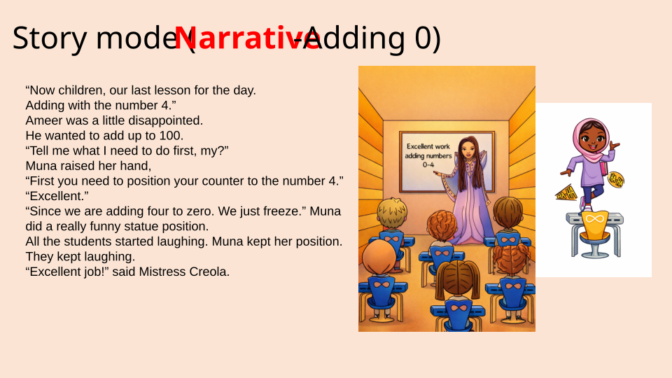

### Content
- Story mode (Narrative-Adding 0)
- “Now children, our last lesson for the day.
Adding with the number 4.”
Ameer was a little disappointed.
He wanted to add up to 100.
“Tell me what I need to do first, my?”
Muna raised her hand,
“First you need to position your counter to the number 4.”
“Excellent.”
“Since we are adding four to zero. We just freeze.” Muna did a really funny statue position.
All the students started laughing. Muna kept her position.
They kept laughing.
“Excellent job!” said Mistress Creola.

---

## Scene 42
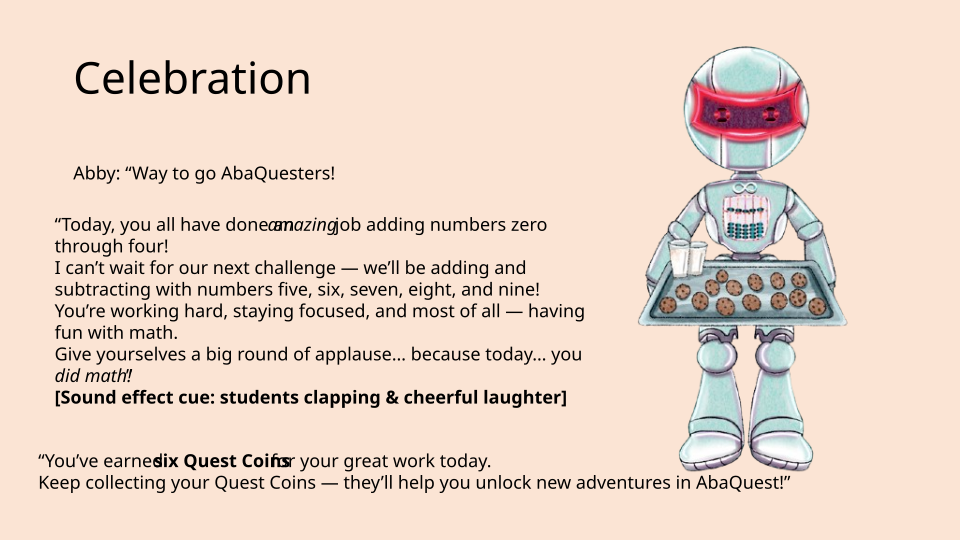

### Content
- Celebration
- Abby: “Way to go AbaQuesters! 
- “Today, you all have done an amazing job adding numbers zero through four!I can’t wait for our next challenge — we’ll be adding and subtracting with numbers five, six, seven, eight, and nine!You’re working hard, staying focused, and most of all — having fun with math.Give yourselves a big round of applause… because today… you did math!”
[Sound effect cue: students clapping & cheerful laughter]

- “You’ve earned six Quest Coins for your great work today.Keep collecting your Quest Coins — they’ll help you unlock new adventures in AbaQuest!”

### Narrator Script (Cousin's Voice)
> On-Screen Actions
Play soft victory fanfare: SFX_CELEBRATION_SHORT
Sparkles and confetti appear around the classroom.
Quest Coins drop into the player’s pouch one by one with a gentle chime.
Text on screen:
“You earned 6 Quest Coins for your hard work!”
All students clap and smile.
Abby steps forward and offers cookies as she speaks.

---

## Scene 43
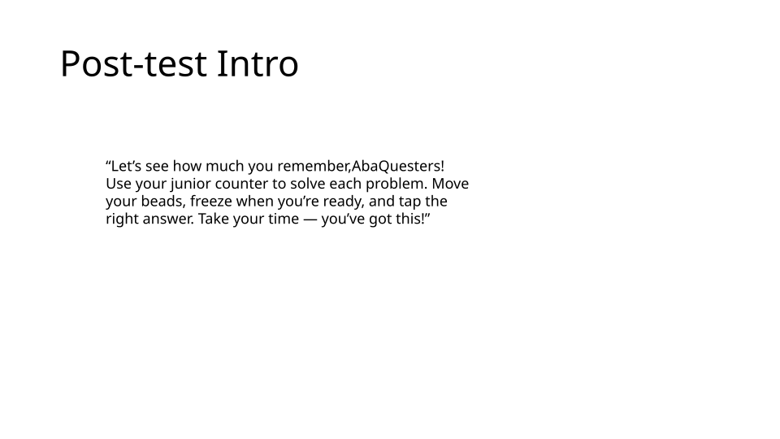

### Content
- Post-test Intro
- “Let’s see how much you remember,AbaQuesters!Use your junior counter to solve each problem. Move your beads, freeze when you’re ready, and tap the right answer. Take your time — you’ve got this!”

---

## Scene 44
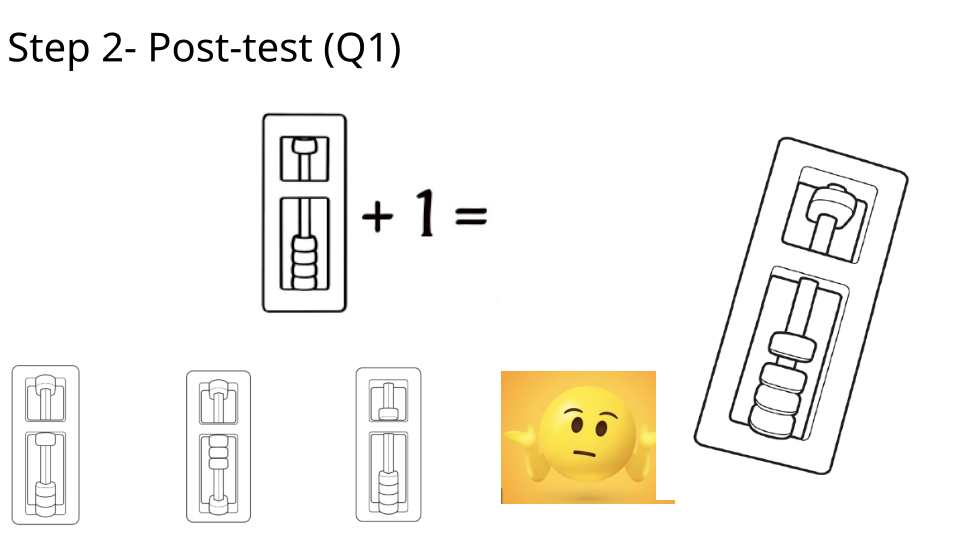

### Content
- Step 2- Post-test (Q1)

---

## Scene 45
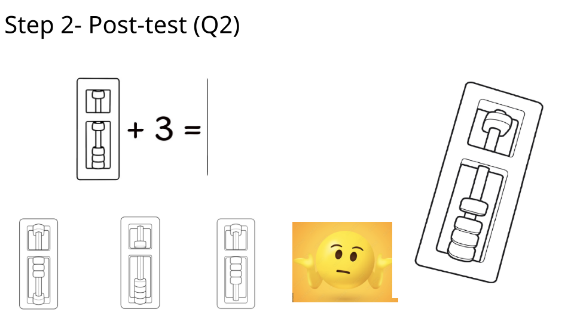

### Content
- Step 2- Post-test (Q2)

---

## Scene 46
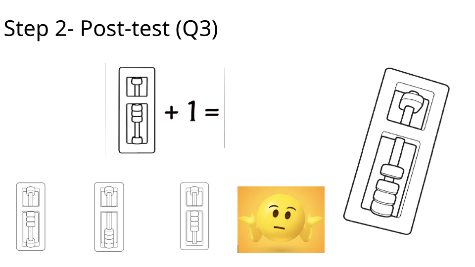

### Content
- Step 2- Post-test (Q3)

---

## Scene 47
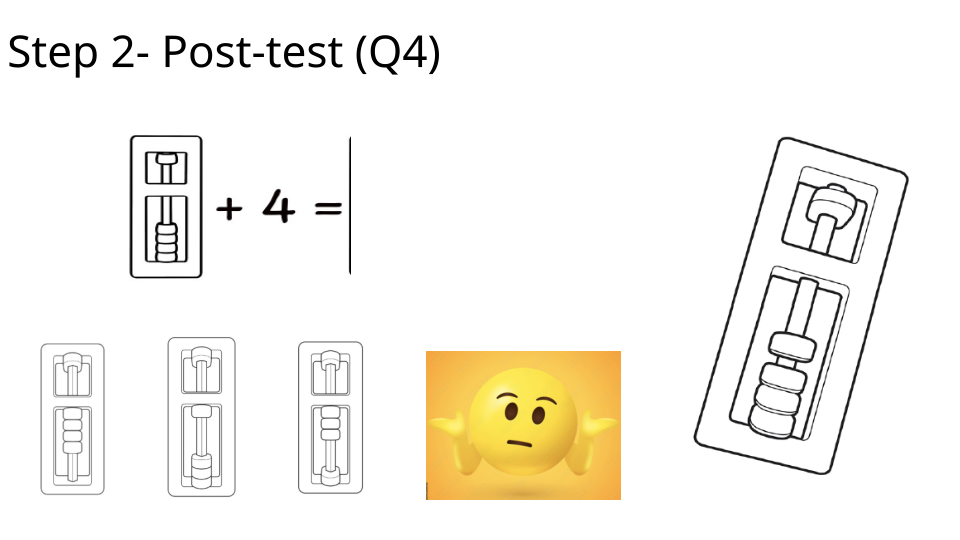

### Content
- Step 2- Post-test (Q4)

---

## Scene 48
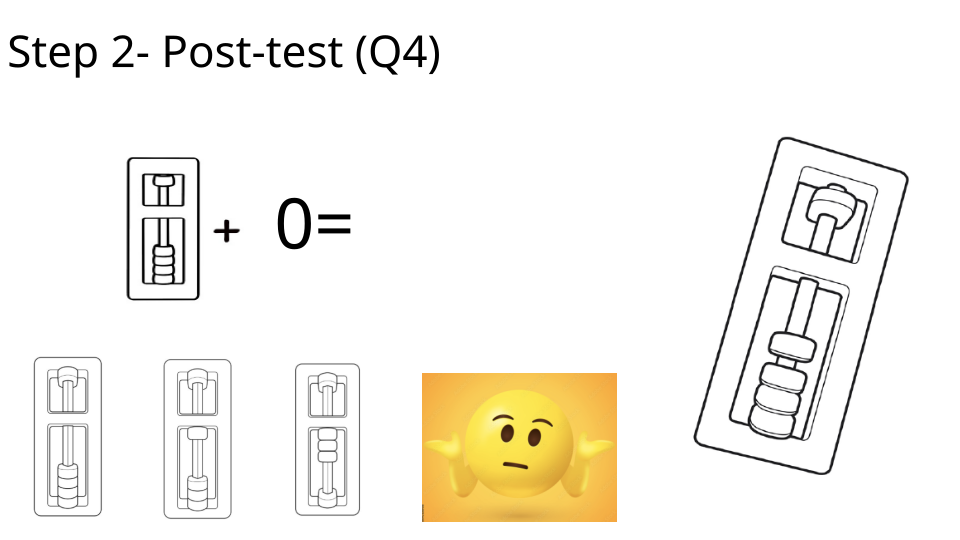

### Content
- Step 2- Post-test (Q4)
- 0=

---

## Scene 49
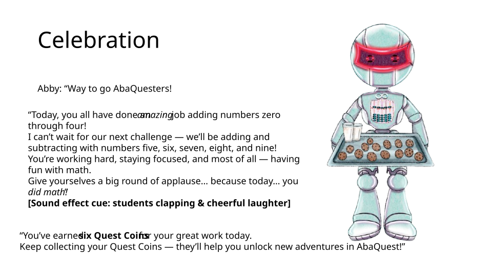

### Content
- Celebration
- Abby: “Way to go AbaQuesters! 
- “Today, you all have done an amazing job adding numbers zero through four!I can’t wait for our next challenge — we’ll be adding and subtracting with numbers five, six, seven, eight, and nine!You’re working hard, staying focused, and most of all — having fun with math.Give yourselves a big round of applause… because today… you did math!”
[Sound effect cue: students clapping & cheerful laughter]

- “You’ve earned six Quest Coins for your great work today.Keep collecting your Quest Coins — they’ll help you unlock new adventures in AbaQuest!”

### Narrator Script (Cousin's Voice)
> On-Screen Actions
Play soft victory fanfare: SFX_CELEBRATION_SHORT
Sparkles and confetti appear around the classroom.
Quest Coins drop into the player’s pouch one by one with a gentle chime.
Text on screen:
“You earned 6 Quest Coins for your hard work!”
All students clap and smile.
Abby steps forward and offers cookies as she speaks.

---

